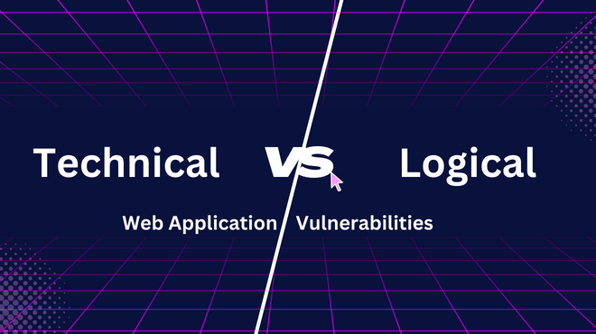
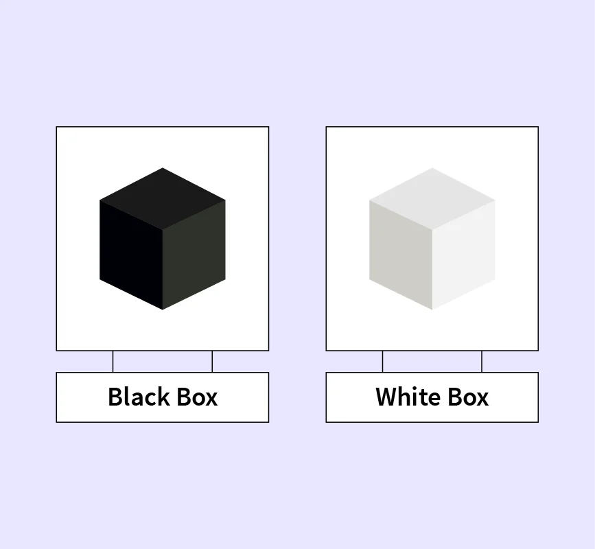
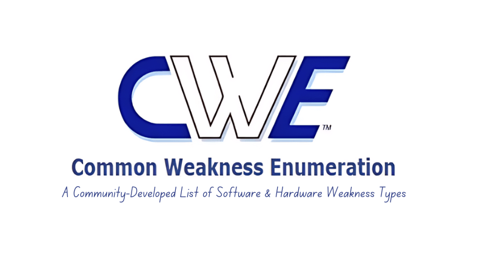
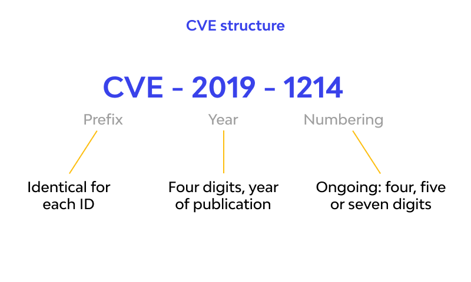

## **1, Hacking là gì?** 
  

Trước khi bắt đầu vào hacking web hay bất kỳ cái gì khác thì bạn cần hiểu hacking là gì trước tiên. Vậy rốt cục hack là làm cái chi? có phải ngầu lòi như các anh hacker trên phim ngồi lạch cạch vài phím rồi “ACCESS GRANTED” hay là một đống cửa sổ hiện lên về thông tin nạn nhân hay không?  Khồng, khồng khồng, hack không phải là như vậy. 
Hacking hiểu đơn giản là sử dụng các tính năng như một người bình thường nhưng bằng cách nào đó lại đạt được kết quả khác so với kết quả dự định ban đầu của tính năng đó. Hay đơn giản hơn là sử dụng 1 tính năng 1 cách “sáng tạo” để đạt được một kết quả khác thường so với mục đích ban đầu tạo ra tính năng đó.  

Ví dụ đơn giản như: Tính năng chuyển tiền của ngân hàng.  
|                          | Cách sử dụng        | Kết quả                                             |
|            ----          |    ----             |  ----                                               |
| Người dùng bình thường   | Nhập số tiền dương  | Tiền được chuyển và tài khoản bị trừ                |
| Hacker                   | Nhập số tiền âm     | Tiền không được chuyển và tài khoản được cộng tiền  |
 
Đơn giản như vậy đó, hacker đã có thể mở khóa “tính năng ẩn” của tính năng ban đầu. Như vậy bạn có thể có vô hạn tiền =))) đùa thôi trên chỉ là 1 ví dụ cho bạn dễ hiểu hơn về thế nào là cách sử dụng “sáng tạo” các tính năng chứ giờ không ngân hàng nào có lỗ hổng như thế đâu nhé.  
## **2, Phân loại lỗ hổng.**
  

Rồi đến phần thứ 2 là phân loại lỗ hổng. Vậy trước tiên bạn cần hiểu lỗ hổng là gì trước. 
Lỗ hổng là một điểm yếu trong phần mềm, website, hoặc hệ thống mà hacker có thể lợi dụng để làm những việc mà người tạo ra nó không muốn. Nôm na là các tính năng được cấu hình không đảm bảo về mặt kỹ thuật hoặc logic.   
Về tổng quan thì có thể chia lỗ hổng thành 2 loại chính: ***Technical*** và ***Logical***.  
-	**Technical vulnerability:** Đây là các lỗ hổng liên quan đến vấn đề kỹ thuật, thường xuất phát từ các sai sót trong code, cấu hình, hoặc các yếu tố kỹ thuật của hệ thống. Các lỗ hổng này có thể dễ dàng phát hiện và khai thác thông qua các công cụ tự động rà quét mã nguồn hoặc kiểm thử bảo mật. Các lỗ hổng này cũng dễ dàng khắc phục.
Ví dụ như: SQL Injection, XSS, OS command injection, SSRF, SSTI, Diractory Traversal, …
-	**Logical Vunlerability:** Đây là các lỗ hổng liên quan đến lỗi trong logic xử lý của hệ thống, thường là do cách thiết kế không chính xác hoặc không tính toán đến mọi tình huống có thể xảy ra. Những lỗ hổng này khó phát hiện vì thường liên quan đến logic nghiệp vụ hoặc quy trình của hệ thống. Để phát hiện ra các lỗ hổng này, bạn phải hiểu rõ về nghiệp vụ liên quan đến ứng dụng đang test. Loại lỗ hổng này tốn nhiều công sức để khắc phục.
Ví dụ như: Broken Authentication, Broken Authorization, Broken Access Control, Information Disclosure...
## **3, Tư duy đặt câu hỏi.** 
Áp dụng phương pháp 4W vào trong pentest (What – Why – Where – When)  
-	What: Bạn muốn tìm lỗ hổng gì? Phạm vi nào trong ứng dụng?  
-	Why: Lỗ hổng xảy ra khi nào? Dấu hiệu nhận biết là gì?  
-	Where: Vị trí nào thường xuất hiện, có liên quan đến dấu hiệu đó?  
-	When: Khi nào thì chức năng hoạt động bình thường? Khi nào thì không bình thường?  

Khi trả lời được các câu hỏi trên thì bạn dần tìm ra manh mối và lỗ hổng một cách dễ dàng hơn. Và để trả lời được thì cần “Kiến thức – Kinh nghiệm”. 
## **4, Phương pháp pentest**
   

Có rất nhiều phương pháp để pentest. Nhưng mình sẽ chỉ bàn đến 2 phương pháp phổ biến nhất: ***Blackbox*** và ***whitebox***.  
-	Blackbox pentest là phương pháp kiểm thử mà hacker không có thông tin trước về hệ thống, ứng dụng hoặc mạng mục tiêu. Hacker sẽ đóng vai trò là một người tấn công bên ngoài, cố gắng thu thập mọi thông tin và tấn công vào hệ thống. Với phương pháp này thì tư duy liên tục đặt câu hỏi, liên tục thử đúng sai, fuzz all the thing thử mọi cách bạn có thể để tấn công mục tiêu. 
-	Whitebox pentest là phương pháp kiểm thử mà hacker được cung cấp toàn bộ thông tin về hệ thống, ứng dụng hoặc mạng mục tiêu, bao gồm mã nguồn, cấu trúc hệ thống, tài liệu kiến trúc… với phương pháp này thì tốn nhiều thời gian hơn và gần như không có false positive. 
## **5, Tam giác CIA vs DDD.**
  

Dừng lại, trước khi đọc tiếp ném ngay cái khái niệm CIA là Central Intelligence Agency ra khỏi đầu hoặc DDD là Destroy D*** December đi nhé =))) vì khái niệm chúng ta đề cập đến đây là khác.  
Tam giác CIA – tam giác đại diện cho độ an toàn của một hệ thống với: 
-	C – Confidental (Tính bảo mật)
-	I – Intergrity (Tính toàn vẹn) 
-	A – Availability (Tính sẵn sàng)

Muốn đánh giá một hệ thống có đảm bảo an toàn hay không thì chúng ta sẽ đánh giá vào 3 khía cạnh đó, cứ một trong 3 cạnh bị phá vỡ tức là hệ thống có lỗ hổng hay cứ có thể phá vỡ 1 trong 3 cạnh của tam giác trong 1 hệ thống là đã được gọi là hack thành công.  
Còn tam giác DDD là tam giác của hacker đối nghịch với tam giác CIA: 
-	D – Disclosure (Rò rỉ)
-	D – Destruction (Phá hủy)
-	D – Denial (Từ chối)

Khi hack 1 hệ thống, bạn chỉ cần làm được 1 trong 3 cạnh của tam giác vậy là đã tấn công được hệ thống đó. 
## **6, OWASP, CWE, CVE và CVSS là gì?**
  

Muốn là web pentester thì không thể không biết đến **OWASP** – Open Web Application Security Project. Đây là một tổ chức phi lợi nhuận toàn cầu, chuyên tập trung vào cải thiện bảo mật ứng dụng web và phần mềm. Theo truyền thống thì cứ mỗi 3 năm, OWASP sẽ tung ra danh sách liệt kê top 10 lỗ hổng bảo mật phổ biến nhất trong ứng dụng web. Ban đầu họ định 1 năm ra 1 lần nhưng không đủ nhân lực nên chuyển thành 3 năm. Bản mới nhất của top 10 OWASP hiện tại đang là 2021, dù đã cuối 2024 nhưng vẫn chưa đc tung ra bản mới và có lẽ sẽ phải đợi năm sau để có rồi.  

Theo như bí kíp truyền từ đời này sang đời khác thì khi test bug của các website thì cứ mang top 10 OWASP ra test trước vì nó là những lỗ hổng phổ biến nhất nên tỷ lệ rơi vào sẽ cao hơn những lỗ hổng khác.   
  

Tiếp đến **CWE** – Common Weakness Enumeration là một hệ thống phân loại các điểm yếu của phần cứng, phầm mềm. Nó gắn mã định danh, mô tả lại lỗ hổng bằng ngôn ngữ khoa học (tạo ra các định nghĩa chung, thống nhất để mô tả các lỗ hổng), có ví dụ chi tiết cùng cách cấu hình khắc phục chi tiết. Hệ thống này được duy trì bởi MITRE với sự hỗ trợ của cộng đồng bảo mật quốc tế. Ví dụ 1 vài mã định danh: CWE-89: SQL Injection, CWE-79: Cross-Site Scripting,…   
  

Và cuối cùng đến **CVE** – Common Vulnerability and Exposures. Nếu CWE là mô tả những điểm yếu cơ bản, thì CVE đi vào chi tiết hơn, nó tập trung vào mô tả các lỗ hổng cụ thể của 1 ứng dụng/phần mềm/hệ thống với phiên bản cụ thể. Nó giống như 1 bản thông báo tới cộng đồng về một lỗ hổng của một ứng dụng tại phiên bản x.x.x vừa mới được phát hiện. Mỗi CVE đều có mã (CVE-year-id) và mô tả đi kèm theo chúng.    
  

Để đánh giá xem một lỗ hổng có nghiêm trọng hay không thì ta cần phải chấm điểm cho nó. Không thể để sót điều này, CVSS ra đời để chấm điểm và đánh giá lỗ hổng cho bạn. 
**CVSS** (Common Vulnerability Scoring System) là một hệ thống tiêu chuẩn được sử dụng để đánh giá mức độ nghiêm trọng của các lỗ hổng bảo mật. CVSS cung cấp một điểm số từ 0.0 đến 10.0 nhằm biểu thị mức độ rủi ro của một lỗ hổng và hỗ trợ việc ưu tiên xử lý chúng. 
### **Các thành phần của CVSS** 
CVSS có 3 nhóm chỉ số chính: 

**Base Metrics** (Chỉ số cơ bản):
-	Đánh giá đặc tính cố định của lỗ hổng, không thay đổi theo môi trường.
-	Gồm các tiêu chí như:
	-	**Attack Vector (AV):** Phương thức tấn công (Mạng, Cục bộ,...).
	-	**Attack Complexity (AC):** Độ phức tạp của tấn công.
	-	**Privileges Required (PR):** Yêu cầu quyền truy cập.
	-	**User Interaction (UI):** Yêu cầu tương tác từ người dùng.
	-	**Scope (S):** Phạm vi bị ảnh hưởng (Cùng hoặc khác nhau giữa các thành phần).
	-	**Impact (Confidentiality, Integrity, Availability):** Tác động đến tính bảo mật, toàn vẹn, và sẵn sàng. 

**Temporal Metrics** (Chỉ số tạm thời):
-	Đánh giá yếu tố tạm thời của lỗ hổng, có thể thay đổi theo thời gian.
-	Gồm các tiêu chí như:
	-	**Exploit Code Maturity (E):** Mức độ hoàn thiện của mã khai thác.
	-	**Remediation Level (RL):** Tình trạng khắc phục.
	-	**Report Confidence (RC):** Độ tin cậy của báo cáo. 

**Environmental Metrics** (Chỉ số môi trường):
-	Đánh giá mức độ ảnh hưởng của lỗ hổng trong một môi trường cụ thể.
-	Gồm các tiêu chí như:
	-	**Modified Base Metrics:** Điều chỉnh chỉ số cơ bản cho phù hợp với môi trường.
	-	**Security Requirements:** Độ quan trọng của bảo mật, toàn vẹn, và sẵn sàng trong môi trường.
## **7, Kết**
Well, tới đây thì bạn đã có một cái nhìn sơ bộ một phần góc nhỏ các khái niệm cần phải biết khi bắt đầu vào với thế giới của hacker. Hẹn gặp lại các bạn vào những bài post sắp tới. Hy vọng sẽ sớm vì tôi lười viết =)) 
