Chắc mọi người đọc writeup CTF nhiều rồi, nay thì mình đổi gió cái nhỉ :D

Trong bài này chúng ta sẽ nói về hành trình bringup của mình với chiếc Nokia 8 để nó có thể chạy được Android 15 (LineageOS 22.1) và chúng ta sẽ nói về AOSP, hay còn gọi là Android Open Source Project, và Nokia.

## Long story short về HMD Global
HMD không trực tiếp sản xuất những chiếc Nokia, các sản phẩm của HMD đều là những thiết bị [ODM](https://nuumobile.com/android-oems-vs-odms-5-things-you-should-know/#:~:text=ODM%20stands%20for%20%E2%80%9Coriginal%20design,as%20%E2%80%9Cwhite%2Dlabelling%E2%80%9D.). Có thể kể đến các ODM nổi tiếng đã sản xuất thiết bị cho Nokia là [FIH](https://www.fihmobile.com/en/index.php) (subcompany của Foxconn), [Huaqin](https://en.huaqin.com/) hay [Longcheer](https://www.longcheer.com/), và 1 vài ODM nữa mà mình không tiện kể, nhưng bạn có thể đọc ở trên [HMD Global Wiki](https://hmd.fandom.com/wiki/HMD_Global).

Từ sau chiếc Nokia 8, doanh số HMD lao dốc hẳn. Chiếc máy này được ra mắt vào năm 2017, là một budget flagship đầu tiên của HMD sau khi mua được Nokia, và cũng là chiếc flagship bán chạy nhất của HMD. Sau 2017 thì có 2 flagship được ra mắt là chiếc Nokia 8 Sirocco nhưng doanh số cũng chả an thua mấy vì cấu hình vừa cùi lại còn giá cao nữa, hay nếu bạn biết đến con Nokia có thể trigger chứng sợ lỗ của bạn (nó cũng flop luôn, kiểu mỗi năm HMD experiment 1 thứ):

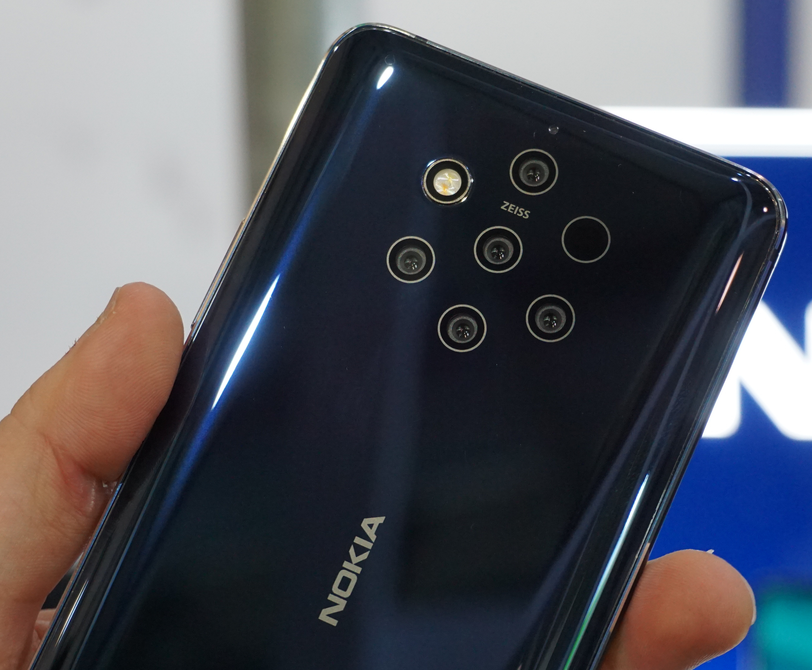

Nokia 9 PureView ra mắt vào 2019, sử dụng Qualcomm Snapdragon 845 - thực ra cũng không tệ vào thời điểm đó, nhưng vấn đề là HMD bắt nó gánh 5 con cảm biến 12MP và 1 cảm biến ToF (2x RGB, 3x native B/W và 1x ToF) - 7 sensors tất cả nếu bạn tính cả cái front camera (20MP) của nó nữa, thứ mà đến giờ Xiaomi còn chưa nghĩ tới được =)))))

7 camera sensors trên một chiếc điện thoại, madness. Thế quái nào nó vẫn win giải [Good Design Award](https://www.good-designawards.com/award-details.html?award=34762) =)))))

Thực ra thì cam B/W của nó mang lại các file DNG có chất lượng thực sự tốt. Nhưng chiếc 9 PureView này còn các vấn đề liên quan đến cảm biến vân tay rất chậm, hiệu năng, thời lượng pin, và image processing - nếu bạn mang đi chụp người yêu thì mình nghĩ là người yêu bạn sẽ chia tay trước khi mà chiếc máy này xử lý xong bức ảnh đấy vì nó xử lý hình ảnh rất lâu :D

À còn quên chưa nói, chiếc máy này được ra mắt với Android 9, đúng ra theo roadmap phải được lên Android 11 nhưng HMD nói là "máy này yếu lắm rồi, không lên được đâu em nhé" =))))))))) và offer bạn 50% discount cho chiếc Nokia XR20, 1 con low end chạy Snapdragon 480 :D

Source: [HMD Global backs out of Nokia 9 PureView Android 11 upgrade, blames camera system](https://www.theverge.com/2021/12/1/22811988/hmd-global-nokia-9-pureview-android-11-software)

Thực ra thì cái camera system chả liên quan gì đến hiệu năng của nó cả =)))) biết cách tối ưu thì ngon, chả qua là FIH không muốn.

Nói đến đây thì chắc bạn cũng hiểu những chiếc Nokia có software tệ thế nào, mặc dù thiết bị của họ mang tiếng chạy Android One "thuần Google" hoặc các phiên bản nội địa Trung Quốc thì chuẩn là AOSP rebrand luôn.

Không phải tự dưng người ta muốn custom ROM để giải quyết những vấn đề đó cho những chiếc điện thoại Nokia.

Chiếc Nokia 8 này cũng không kém cạnh (chính mình là người đã sử dụng nó trong vòng 5 năm, nhưng mà mình trộm vía nên máy vẫn sống đến bây giờ :D), bắt đầu với những bản OTA mà khi bạn cài xong nó sẽ treo mãi ở boot splash (at this point, call it **bricked**), hoặc random reboot, sóng yếu, GPS có vấn đề, hoặc đang dùng tự dưng màn hình của bạn làm quả ối dồi ôi:

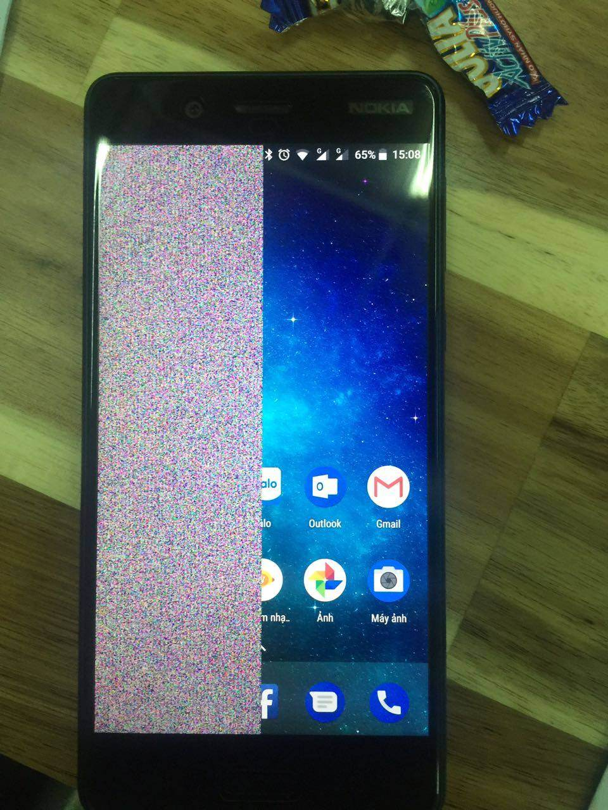

Đọc đến đây chắc bạn cũng hiểu luôn Nokia làm quality control đến cả phần cứng tệ đến mức nào.

Và HMD cũng chả mấy quan tâm đến mảng OSS development cho lắm (thực ra là anti-OSS). 

Ngày xưa thì cho phép unlock bootloader, sau này thì không còn nữa (mặc dù giờ đã có tool giúp chúng ta có thể bootloader unlock những chiếc Nokia mà không phải trả phí). 

Hoặc kernel source - với một số thiết bị đời đầu của Nokia thì các kernel source sẽ được tích cực upload lên ở mỗi một ASB (Security Patch) update hoặc 1 major OS update.

Từ chiếc Nokia 8.1 hoặc Nokia 9 (`msm-4.9`), những chiếc này là thời kì bắt đầu của việc sử dụng kernel module trong Android thay vì built-in như các phiên bản kernel cũ hơn. Và component được chuyển sang thành kernel module trong `msm-4.9` là audio techpack (bao gồm các audio codecs, amplifier, ...)

Source: [HMD Global Open Source](https://www.hmd.com/en_int/opensource).

Nhưng Nokia nói không với việc release source code của các module đó =)))) những chiếc máy này đến hiện tại vẫn còn đang sử dụng các [prebuilt kernel modules](https://github.com/zskynet09/android_device_nokia_PNX_sprout/tree/arrow-13.1/prebuilt/modules), vì Nokia có release đâu mà đòi build từ source. Các module này cũng thuộc phạm trù GPL, và Nokia đã không public source code của các kernel module đó ra.

Nếu bạn biết về giấy phép GPL trong software:
* Khi một phần mềm có giấy phép GPL, bất kỳ ai cũng có thể sao chép, sửa đổi và phân phối lại nó.
* Điều kiện quan trọng: Nếu ai đó chỉnh sửa phần mềm GPL và phát hành (distribute) nó cho người khác, thì họ bắt buộc phải cung cấp mã nguồn của phiên bản đã sửa đổi. Điều này đảm bảo phần mềm vẫn luôn mở và có thể tiếp tục được chỉnh sửa bởi cộng đồng.

Hoặc như những chiếc Nokia được ODM bởi Longcheer và Huaqin thì cứ theo thông lệ của HMD mà làm: 1 kernel source lúc máy được ra mắt là xong =))))) không còn vấn vương gì nữa, chia tay!

Những chiếc Razer Phone cùng được sản xuất bởi FIH, nhưng source code thì Razer lại cung cấp đầy đủ không thiếu cái nào chả bù cho HMD, ảo lòi thật =)))))))))))

Source: [Razer Phone Kernel Source Code](https://developer.razer.com/razer-phone-dev-tools/kernel-source-code/)

### TL;DR về HMD OSS development
* HMD có release kernel source, nhưng không release kernel module source code (điều này áp dụng với tất cả các thiết bị của HMD)
* FIH là thằng upload kernel source tích cực nhất, nhưng các thiết bị sau này của Nokia (sau Nokia `x.1` thì FIH không còn nhúng tay vào sản xuất smartphone của Nokia nữa).
* Longcheer và Huaqin ra mắt 1 phiên bản kernel source xong chuồn luôn.
* Thêm một thông tin nữa: Trước đây HMD đã từng xoá page unlock bootloader, và họ cũng đã "từng" xoá page Open source, nhưng tuy nhiên do bị chửi to đầu nên cái page đó đã quay lại rồi =))))))

Vài drama nữa của Nokia, cho bạn đọc chơi =)))))
* [The Nokia 7.2 is HMD's first phone with an unlockable bootloader](https://www.androidpolice.com/2019/11/04/the-nokia-7-2-is-hmds-first-phone-with-an-unlockable-bootloader/)
* [Nokia Mobile will remove the option to unlock the Nokia 7.2 and Nokia 6.2 bootloader](https://nokiamob.net/2019/11/02/official-nokia-mobile-will-remove-the-option-to-unlock-the-nokia-7-2-and-nokia-6-2-bootloader)
* [Open source page died](https://t.me/HikariCalyxFIH/60)
* [August security update on Nokia phones blocks the only bootloader unlock method](https://www.xda-developers.com/august-security-update-on-nokia-phones-blocks-the-only-bootloader-unlock-method/)

và...


Nếu bạn tò mò về bức ảnh kháy HMD ở trên lấy đâu ra thì mình sẽ để link ở đây: [Nokia8 ROM Installation Guide V2.0.pdf](https://t.me/HMD_Nokia_8/68949), trang cuối.

## Custom ROM/firmware là gì?
Custom ROM/firmware là một phiên bản phần mềm tuỳ chỉnh của OS được tạo bởi một bên thứ 3, hoặc một cộng đồng, và thường được tạo ra nhằm mục đích cải thiện hiệu năng, hoặc mang thêm các tính năng mới cho thiết bị - trong trường hợp của HMD thì là cả 2 =)))))

Ngày xưa thì các thiết bị Android thường được hỗ trợ căng nhất là 2 năm (cụ thể là 2 major OS upgrades).

Chẳng hạn như bạn có chiếc máy A đang chạy Android 6.0, thì chiếc máy đó sẽ có 2 bản cập nhật lớn lần lượt là 7.0 và 8.0 (hoặc subversion là 8.1), sau đó thì thiết bị sẽ rơi vào trạng thái end-of-life và sẽ không còn bản cập nhật nào được phát hành nữa.

Những thiết bị đó hoàn toàn có thể chạy được các phiên bản Android cao hơn, nhưng vấn đề là nhà sản xuất không muốn. Điều này dẫn tới các lỗi trong phần mềm, các lỗ hổng bảo mật vẫn còn tồn tại ở phiên bản OS hiện tại không bao giờ được vá sau khi thiết bị không còn được hỗ trợ nữa.

Custom ROM sinh ra để giải quyết vấn đề này, giúp bạn vừa có up-to-date OS lẫn các bản vá bảo mật trên thiết bị của mình mà không phải tốn vài đồng đi mua cái điện thoại mới :D 

making your phone last as long as possible (TM) - [Fairphone](https://www.fairphone.com/).

## Đôi lời muốn nói trước khi bắt đầu
Xin chào mọi người, mình là lead developer của community project [nokia-msm8998](https://github.com/nokia-msm8998).

Organization này được mình tạo ra với mục đích mang đến những phiên bản custom firmware mới hơn (và custom kernel) cho những chiếc Nokia đang chạy trên SoC dưới của Qualcomm:

- Qualcomm Snapdragon 660 (SDM660) bao gồm những thiết bị sau:

| Device                   | Codename | ODM codename/actual codename          | ODM             | Supported?            |
|:------------------------ |:-------- | :------------------------------------ |:--------------- |:--------------------  |
| Nokia 7 Plus             | `B2N`    | Onyx                                  | FIH Mobile      | Not yet.              |
| Nokia 7                  | `C1N`    | Charm                                 | FIH Mobile      | Not yet.              |
| Nokia 7.1                | `CTL`    | Crystal                               | FIH Mobile      | Not yet.              |
| Nokia 6.1 Plus/X6        | `DRG`    | Dragon                                | FIH Mobile      | Planned.              |
| Nokia 7.2                | `DDV`    | Daredevil (OEM codename: M690)        | Longcheer       | WIP.                  |
| Nokia 6.1                | `PL2`    | Plate2                                | FIH Mobile      | Planned.              |
| Nokia 6.2                | `SLD`    | Starlord (OEM codename: M490)         | Longcheer       | WIP.                  |
| Nokia X71                | `TAS`    | Taishan                               | FIH Mobile      | Not yet.              |

- Qualcomm Snapdragon 835 (MSM8998) bao gồm những thiết bị sau:

| Device                   | Codename | ODM codename/actual codename          | ODM             | Supported?              |
|:------------------------ |:-------- | :------------------------------------ |:--------------- |:----------------------  |
| Nokia 8                  | `NB1`    | Bang                                  | FIH Mobile      | Yes, officially.        |
| Nokia 8 Sirocco          | `A1N`    | Avenger                               | FIH Mobile      | Planned.                |

Với những thiết bị chạy Android One, thì codename thật của nó sẽ là `codename` + `_sprout`, vì đây là truyền thống codename của các thiết bị Android One rồi, nhưng theo quy luật đặt tên của LineageOS thì không cần phải thêm `_sprout` ở cuối, nên codename mình chỉ để codename thật của máy thôi.

Với chiếc Nokia 8, mình đã submit các repository lên trên LineageOS và có CI build nightly hàng tuần, nếu bạn có chiếc máy này thì bạn có thể tải về và cài đặt tại đây, hoặc cài LineageOS cho thiết bị của bạn:
* [Info about NB1 - LineageOS Wiki](https://wiki.lineageos.org/devices/NB1/)
* [Official LineageOS 21 for the Nokia 8 (2017) - XDA](https://xdaforums.com/t/nightly-nb1-official-lineageos-21-for-the-nokia-8-2017.4631835/)

Nếu bạn muốn tự build 1 ROM khác (hoặc LineageOS) dựa trên những device configuration đó, thì hãy xem repo [này](https://github.com/nokia-msm8998/manifests) để biết thêm chi tiết.

**Contributions are welcome!** 

## Android 15 trên chiếc máy 8 năm tuổi, chạy thế quái nào được?
Có nhé, chạy tốt luôn là đằng khác. Vì đây là 1 con flagship SoC, nên nó sinh ra là để trụ lâu nhất có thể.

### Device specifications

| Basic                   | Details                                            |
| :---------------------- |:-------------------------------------------------- |
| CPU                     | Octa-core (4x2.5 GHz Kryo 280 & 4x1.8 GHz Kryo 280 LP) |
| Chipset                 | Qualcomm MSM8998 Snapdragon 835 (10 nm)            |
| GPU                     | Adreno 540                                         |
| Memory                  | 4/6 GB RAM LPDDR4                                  |
| Shipped Android Version | Android 7.1.1 (Nougat), upgradeable to Android 9 (Pie) |
| Storage                 | 64/128 GB UFS 2.1 2-LANE                           |
| Battery                 | Non-removable Li-Ion 3090 mAh battery              |
| Display                 | 1440 x 2560 pixels, 16:9 ratio (~554 ppi density)  |
| Camera (Back)           | 13 MP, f/2.0, 1/3.1", 1.12µm, PDAF, Laser AF, OIS<br>13 MP B/W, f/2.0, 1.12µm, PDAF  |
| Camera (Front)          | 13 MP, f/2.0, (wide), 1/3.1", 1.12µm, PDAF         |

Mình sẽ bắt đầu nói từ Android 12. Khi mình bắt đầu bringup cho chiếc Nokia 8, thì rào cản lớn nhất của mình là nhìn cái [device tree cũ](https://github.com/PixelExperience-Devices/device_nokia_NB1) của nó làm mình vô cùng OCD.

Và chúng ta sẽ đi phân tích tại sao nó lại trigger chứng OCD của mình.

Thực ra người mang AOSP lên chiếc Nokia 8 này đầu tiên chính là [emufan](https://github.com/raphaelthegreat), cái device tree bên trên cũng là của ông ấy luôn, branch `thirteen` thì ông ấy cherry-pick hết changes của mình qua thôi. Nếu mọi người biết đến project [Citra](https://github.com/citra-emu) và Yuzu (cả 2 đều là Nintendo emulators), thì emufan chắc cũng không còn xa lạ gì nữa. Sau Android 12 thì ông này rời AOSP development cho chiếc Nokia 8, và mình lên làm lead dev :D

Để mình đưa ra cho bạn vài keynotes về đám Nokia SDM660/MSM8998:
- Chiếc máy này là A/B partition table và không có phân vùng `vendor` (HMD moment) - nghĩa là chiếc máy này không hỗ trợ Treble. Trên cả cái Trái Đất này chắc có con này và [tissot (Xiaomi Mi A1)](https://wiki.lineageos.org/devices/tissot/) là A/B no `vendor`.
- Khồng có phân vùng nào có thể tận dụng được để support Treble. Chẳng hạn như Xiaomi thì có phân vùng `cust` khoảng 700MB, và phân vùng đó chứa các region-specific configurations, những file apk để preinstall vào máy tuỳ theo khu vực lúc factory reset,... đều vô dụng trên AOSP, nên chiếc Mi 6 đã sử dụng nó để làm phân vùng `vendor` - bạn có thể thấy được tại [fstab.qcom](https://github.com/LineageOS/android_device_xiaomi_msm8998-common/blob/lineage-22.1/rootdir/etc/fstab.qcom#L8) của common device tree.
- Nokia 8 là con duy nhất không có `vendor`, số còn lại đều có `vendor`. Đến chiếc Nokia 6.2/7.2 thì lòi ra thêm `dtbo` và `vbmeta`. Vậy nên chúng ta sẽ chia ra thành 2 fstab.
- Tìm hiểu thêm về Treble: [Here comes Treble: A modular base for Android
](https://android-developers.googleblog.com/2017/05/here-comes-treble-modular-base-for.html)
- Tìm hiểu thêm về A/B partition table: [A/B (seamless) system updates](https://source.android.com/docs/core/ota/ab)
- Nokia msm8998/sdm660 có thể sử dụng chéo blobs của nhau. Ở đây mình đang dùng phần lớn là của Nokia 7.2 (DDV_sprout) R release, vì blobs của nó là mới nhất trong tổng số các máy hiện có trong family rồi, một số thì mình lấy từ FP3 T release (Fairphone 3).

Vậy nên cộng đồng của chiếc Nokia 8 này đã đưa ra solution giải quyết trực tiếp vấn đề đó, chính là reparition (phân vùng lại), và bạn có thể tham khảo tại đây: [T-Virus](https://github.com/resident-nokia/t-virus).

Để mình giải thích ngắn gọn cách hoạt động của T-Virus nhé:
- Chiếc 8 Sirocco có Treble (vì launch version của nó là Android 8), và Bootloader của Nokia cho phép nạp GPT table khác vào bằng lệnh `fastboot flash partition:0`. Lấy luôn firmware của con Sirocco, nạp gpt_both0.bin vào - giờ chúng ta đã có phân vùng `vendor`. Đến đây thì có thể tạm thời gọi là có Treble rồi.
- Nhưng có mỗi cái vendor mà trống trơn thì làm sao mà boot được GSI? Chúng ta có thể dump luôn cái vendor ở trong /system/vendor của con 8 ra và điều chỉnh theo ý muốn cũng như là patch 1 số blobs để cho nó load ở `/vendor` thay vì `/system/vendor` như cũ, sau đó repack thành `vendor.img` - giải quyết xong vấn đề thứ 2. Giờ thì chúng ta đã có full Treble, có thể nạp [GSI](https://developer.android.com/topic/generic-system-image) và boot bình thường như 1 chiếc máy support Treble native.

Và đó là cách mà T-Virus hoạt động. Tạo ra phân vùng `vendor` nhưng phải flash lại toàn bộ firmware, hơi tốn dung lượng nhỉ :D

Đọc đến đây thì bạn đã thấy AOSP trên chiếc Nokia 8 này đang phải repartition để có Treble, nhưng repartition là một điều mà mình vô cùng ghét vì nó tiềm ẩn vô cùng nhiều nguy cơ để biến chiếc điện thoại của bạn thành cục chặn giấy đúng nghĩa. Bạn sẽ hiểu vì sao mình lại ghét nó sau, nhưng giờ thì cứ đọc tiếp đã :P

Vậy nên bắt đầu với Android 14, mình đã quyết định làm lại device tree từ con số 0 cho con này vì lúc đó nhìn nó khá là cursed (người ta còn hỏi mình liệu nó có đáng để rebuild nó lại không vì platform này 7 năm tuổi rồi), và nhằm mục đích hợp nhất cả đám Nokia SDM660 lẫn MSM8998 vào chung 1 common device tree.

Mình sẽ tái cấu trúc lại các repo ở trong nokia-msm8998 như sau:
- [android_device_nokia_NB1](https://github.com/nokia-msm8998/android_device_nokia_NB1) - Device specific configurations (các thiết bị khác thì sẽ có codename khác)
- [android_device_nokia_msm8998-common](https://github.com/nokia-msm8998/android_device_nokia_msm8998-common) - Common device configurations để các thiết bị khác có thể pick up common configurations từ đây
- [android_kernel_nokia_msm8998](https://github.com/nokia-msm8998/android_kernel_nokia_msm8998) - Kernel source
- [proprietary_vendor_nokia_NB1](https://github.com/nokia-msm8998/proprietary_vendor_nokia_NB1) - Proprietary vendor blobs/device specific firmware (các thiết bị khác thì sẽ có codename khác)
- [proprietary_vendor_nokia_msm8998-common](https://github.com/nokia-msm8998/proprietary_vendor_nokia_msm8998-common) - Proprietary common vendor blobs

2 con SoC: `SDM660` và `MSM8998` - nói thẳng ra thì chúng nó giống kiểu anh em ruột thịt, sự tương đồng giữa chúng nó với nhau là rất lớn (chẳng hạn như 2 con SoC đó đều chạy trên kernel `msm-4.4`, hoặc các blobs có thể dùng chéo của nhau được) nên 2 con SoC này có thể unify vào thành 1 [common codebase](https://github.com/nokia-msm8998/android_device_nokia_msm8998-common) để mình không phải maintain nhiều source code cùng 1 lúc.

Kernel 4.4 và 4.9 đã được drop support từ Android 14, nhưng patchset [này](https://review.lineageos.org/c/LineageOS/android_packages_modules_Connectivity/+/386201) đã mang support lại vì các tính năng eBPF có thể được backport từ các kernel mới hơn xuống.

Nói trước để mọi người bớt băn khoăn :D

## Việc đầu tiên: Bỏ hoàn toàn repartition
### Overview
Trước tiên thì chúng ta nên tìm hiểu, repartition là gì?

Repartition là một hình thức để chỉnh sửa phân vùng hệ thống của bạn so với, để thêm hoặc bớt một phân vùng, hoặc để tăng/giảm kích thước của phân vùng nào đó lên so với partition table ban đầu.

Các thiết bị Android sẽ đi kèm với vô vàn phân vùng mà nhà sản xuất muốn cài đặt. Các phân vùng đó đều được hardcode size trong GPT, tuy nhiên bạn vẫn có thể modify được partition table.

Lấy ví dụ nhé, đây là phân vùng của chiếc Nokia 8 (original, trước khi repartition):

Một chiếc máy Qualcomm thường có 6 LUNs, nhưng ở đây mình sẽ chỉ nói về các LUNs chính trong phân vùng hệ thống thôi.

**LUN 0 (lấy tạm partition table của con Nokia 8 này nhưng là bản 128GB nhé, khác nhau ở end address phân vùng `userdata` thôi):**
```
Model: SAMSUNG KLUDG8V1EE-B0C1 (scsi)
Disk /dev/block/sda: 127657836544B
Sector size (logical/physical): 4096B/4096B
Partition Table: gpt
Disk Flags: 

Number  Start        End            Size           File system  Name          Flags
 1      24576B       41967615B      41943040B      ext4         hidden_a
 2      41967616B    50356223B      8388608B       ext4         cda_a
 3      50356224B    50618367B      262144B                     systeminfo_a
 4      50618368B    67395583B      16777216B      ext4         dsp_a
 5      67395584B    182738943B     115343360B                  modem_a       msftdata
 6      182738944B   249847807B     67108864B                   boot_a
 7      249847808B   4007944191B    3758096384B    ext2         system_a
 8      4007944192B  4049887231B    41943040B      ext4         hidden_b
 9      4049887232B  4058275839B    8388608B       ext4         cda_b
10      4058275840B  4058537983B    262144B                     systeminfo_b
11      4058537984B  4075315199B    16777216B      ext4         dsp_b
12      4075315200B  4190658559B    115343360B                  modem_b
13      4190658560B  4257767423B    67108864B                   boot_b
14      4257767424B  8015863807B    3758096384B    ext2         system_b
15      8015863808B  8015871999B    8192B                       ssd
16      8015872000B  8049426431B    33554432B      ext4         persist
17      8049426432B  8050475007B    1048576B                    misc
18      8050475008B  8050999295B    524288B                     keystore
19      8050999296B  8051523583B    524288B                     frp
20      8051523584B  8059912191B    8388608B       ext4         box
21      8059912192B  8060960767B    1048576B                    hwcfg
22      8060960768B  8060964863B    4096B                       sutinfo
23      8060964864B  8128073727B    67108864B                   logdump
24      8128073728B  8165822463B    37748736B                   splash2
25      8165822464B  8182599679B    16777216B                   elabel
26      8182599680B  127657701375B  119475101696B  ext4         userdata
```

**LUN0 (Sau khi được repartition, nhưng lần này được chạy bằng parameters khác nên nó print size ra GB chứ không phải bytes):**
```                                      
Model: SAMSUNG KLUCG4J1ED-B0C1 (scsi)
Disk /dev/block/sda: 63.7GB
Sector size (logical/physical): 4096B/4096B
Partition Table: gpt
Disk Flags: 

Number  Start   End     Size    File system  Name          Flags
 1      24.6kB  42.0MB  41.9MB  ext4         hidden_a
 2      42.0MB  50.4MB  8389kB  ext4         cda_a
 3      50.4MB  50.6MB  262kB                systeminfo_a
 4      50.6MB  67.4MB  16.8MB  ext4         dsp_a
 5      67.4MB  183MB   115MB                modem_a
 6      183MB   250MB   67.1MB               boot_a
 7      250MB   3471MB  3221MB  ext2         system_a
 8      3471MB  4545MB  1074MB  ext2         vendor_a               # Phân vùng vendor
 9      4545MB  4587MB  41.9MB  ext4         hidden_b
10      4587MB  4595MB  8389kB  ext4         cda_b
11      4595MB  4595MB  262kB                systeminfo_b
12      4595MB  4612MB  16.8MB  ext4         dsp_b
13      4612MB  4728MB  115MB                modem_b       msftdata
14      4728MB  4795MB  67.1MB               boot_b
15      4795MB  8016MB  3221MB  ext2         system_b
16      8016MB  9090MB  1074MB  ext2         vendor_b               # Phân vùng vendor
17      9090MB  9090MB  8192B                ssd
18      9090MB  9123MB  33.6MB  ext4         persist
19      9123MB  9124MB  1049kB               misc
20      9124MB  9125MB  524kB                keystore
21      9125MB  9125MB  524kB                frp
22      9125MB  9134MB  8389kB  ext4         box
23      9134MB  9135MB  1049kB               hwcfg
24      9135MB  9135MB  4096B                sutinfo
25      9135MB  9202MB  67.1MB               logdump
26      9202MB  9240MB  37.7MB               splash2
27      9240MB  9256MB  16.8MB               elabel
28      9256MB  63.7GB  54.4GB  ext4         userdata
```

**LUN 4 (LUN này thường chứa các critical partitions để bootloader hoạt động)**
```
Model: SAMSUNG KLUCG4J1ED-B0C1 (scsi)
Disk /dev/block/sde: 210MB
Sector size (logical/physical): 4096B/4096B
Partition Table: gpt
Disk Flags:

Number  Start   End     Size    File system  Name          Flags
 1      24.6kB  549kB   524kB                rpm_a
 2      549kB   2646kB  2097kB               tz_a
 3      2646kB  3170kB  524kB                hyp_a
 4      3170kB  3695kB  524kB                pmic_a
 5      3695kB  4743kB  1049kB               bluetooth_a
 6      4743kB  8937kB  4194kB               mdtpsecapp_a
 7      8937kB  42.5MB  33.6MB               mdtp_a
 8      42.5MB  43.5MB  1049kB               abl_a
 9      43.5MB  44.1MB  524kB                keymaster_a
10      44.1MB  44.6MB  524kB                cmnlib_a
11      44.6MB  45.1MB  524kB                cmnlib64_a
12      45.1MB  45.2MB  131kB                devcfg_a
13      45.2MB  83.0MB  37.7MB               splash_a
14      83.0MB  83.5MB  524kB                rpm_b
15      83.5MB  85.6MB  2097kB               tz_b
16      85.6MB  86.1MB  524kB                hyp_b
17      86.1MB  86.7MB  524kB                pmic_b
18      86.7MB  87.7MB  1049kB               bluetooth_b
19      87.7MB  91.9MB  4194kB               mdtpsecapp_b
20      91.9MB  125MB   33.6MB               mdtp_b
21      125MB   127MB   1049kB               abl_b
22      127MB   127MB   524kB                keymaster_b
23      127MB   128MB   524kB                cmnlib_b
24      128MB   128MB   524kB                cmnlib64_b
25      128MB   128MB   131kB                devcfg_b
26      128MB   166MB   37.7MB               splash_b
27      166MB   166MB   16.4kB               sec
28      166MB   166MB   4096B                devinfo
29      166MB   167MB   1049kB               dip
30      167MB   167MB   262kB                apdp
31      167MB   168MB   262kB                msadp
32      168MB   168MB   4096B                dpo
33      168MB   168MB   4096B                limits
34      168MB   169MB   1049kB               toolsfv
35      169MB   177MB   8389kB               logfs
36      177MB   179MB   2097kB               sti
37      179MB   210MB   30.5MB               storsec
```

**LUN 5 (LUN này thường chứa device identifier)**
```
Model: SAMSUNG KLUCG4J1ED-B0C1 (scsi)
Disk /dev/block/sdf: 33554432B
Sector size (logical/physical): 4096B/4096B
Partition Table: gpt
Disk Flags:

Number  Start      End        Size      File system  Name        Flags
 1      2097152B   4194303B   2097152B               modemst1
 2      4194304B   6291455B   2097152B               modemst2
 3      6291456B   8384511B   2093056B               pad5
 4      8384512B   9433087B   1048576B               deviceinfo
 5      9433088B   17821695B  8388608B  ext4         securefs
 6      17821696B  19918847B  2097152B               rf_nv
 7      19918848B  22015999B  2097152B               nvcust
 8      22016000B  26210303B  4194304B               nvdef_a
 9      26210304B  30404607B  4194304B               nvdef_b
10      30404608B  32501759B  2097152B               fsg
11      32501760B  33419263B  917504B                fsc
```

Mình sẽ nói sơ qua về các phân vùng ở trên (cái nào cần thiết mình sẽ nói), giúp bạn hiểu rõ hơn về cấu trúc phân vùng của một chiếc máy dùng SoC của Qualcomm từ 2017 đổ về (và một vài phân vùng của FIH, nó khá là tương đồng với Razer Phone - vì đều chung ODM là FIH):

| Phân vùng    | Công dụng          |
|:------------ |:------------------ |
| `abl`        | Kế thừa của phân vùng `aboot` ngày xưa, giờ đã thành proprietary solution (ABL - Android Boot <br>Loader), vừa đóng vai trò gánh các command được gửi từ `fastboot` xuống, vừa sử dụng để load <br>kernel và DTB từ boot image. |
| `xbl`        | Phiên bản thay thế của `sbl` (Secondary Boot Loader) (xưa `sbl` được chia<br>thành `sbl1`, `sbl2`, `sbl3` ở các SoC cũ hơn), `xbl` (hay còn gọi là eXtended Boot Loader), <br>đảm nhiệm vai trò khởi tạo hardware, CPU cache, PMIC và DDR, load TEE (Trusted Environment<br>Execution), Hypervisor (`hyp`) và UEFI. Nếu `abl` hoặc `xbl` bị corrupt thì SoC sẽ nhảy vào <br>`EDL` - hay còn gọi là Emergency Download Mode. Đọc thêm tại [đây](https://docs.qualcomm.com/bundle/publicresource/topics/80-70015-4/bootloader.html). |
| `modem`      | Chứa baseband firmware, hoặc chứa các firmware cho linh kiện trong thiết bị, lúc khởi động rồi <br>thì modem firmware sẽ được mount tại `/vendor/firmware_mnt`. |
| `keymaster`  | Qualcomm Keymaster Implementation. Đọc thêm tại [đây](http://bits-please.blogspot.com/2016/06/extracting-qualcomms-keymaster-keys.html). |
| `dsp`        | Qualcomm Digital Signal Processing. |
| `devinfo`    | Chứa các bootloader variable chẳng hạn như `unlocked`, `off-mode-charge`, <br>`charger-screen-enabled` - sẽ được load khi bạn chạy command như <br>`fastboot oem device-info` hoặc `fastboot getvar all` trong Bootloader mode. |
| `splash`     | Splash screen, là cái logo mà lúc bạn giữ nút nguồn để khởi động lên trước khi vào Android. <br>Trong trường hợp của chiếc Nokia này thì, phân vùng này để làm cảnh do FIH dùng `splash2`. |
| `rpm`        | Resource/Power Management. Đọc thêm tại [đây](https://android.googlesource.com/kernel/msm/+/refs/tags/android-9.0.0_r0.114/Documentation/arm/msm/rpm.txt). |
| `tz`         | Qualcomm TrustZone. Đọc thêm tại [đây](http://bits-please.blogspot.com/2015/08/exploring-qualcomms-trustzone.html). |
| `cmnlib(64)` | Bổ trợ cho TrustZone, đọc tại [đây](https://research.checkpoint.com/2019/the-road-to-qualcomm-trustzone-apps-fuzzing/). |
| `modemst{1/2}` | Phân vùng này chứa ESN/IMEI/MAC + được sign + được mã hoá. Tuy nhiên nếu phân vùng này bị <br>xoá, thì đồng nghĩa với việc say goodbye to RIL functions. Tuỳ thuộc vào OEM sẽ có các cách <br>implement các thông số này ở phân vùng khác nhau, chẳng hạn như `persist` ở các thiết bị Moto <br>hoặc `EFS` ở Samsung. |   
| `securefs`   | Đây là phân dùng của FIH và được sử dụng để lưu DRM keys. Phân vùng này sẽ bị xoá khi mà <br>bootloader đã được unlock, và bạn sẽ không thể playback DRM contents ở chất lượng cao nữa <br>(vì Widevine không load được hardware DRM keys, nên nó fallback về software DRM mà SW DRM <br>thì chỉ max ở 480p thôi). Nếu bạn đã từng dùng qua những chiếc Sony Xperia, thì DRM keys ngày <br>xưa hay được lưu ở phân vùng TA, và 1 khi unlock bootloader thì goodbye Bravia Engine hoặc một <br>vài tính năng trong app Camera. |   
| `hidden`     | Phân vùng này của FIH và chỉ có ở trên Nokia, và nó chứa Nokia USB drivers để sử dụng trong <br>Windows. Khá là generic vì Nokia chả còn driver nào đặc biệt, lấy trên [này](https://developer.android.com/studio/run/win-usb) thậm chí còn nhanh <br>hơn. Hãy note lại ở phân vùng này, vì ở đoạn dưới chúng ta sẽ sử dụng đến nó trong phần sau. |   
| `boot`       | Phân vùng này chứa boot image, kernel, DTB. |
| `system`     | Android sẽ được cài đặt vào đây. Nếu thiết bị không có vendor thì sẽ được mount <br>ở `/system/vendor`. |
| `vendor`     | Chứa các vendor interfaces, services, libraries và blobs. |
| `elabel`     | Phân vùng này của FIH nhưng chỉ tồn tại ở các thiết bị Nokia, được sử dụng để hiển thị regulatory <br>info trong cài đặt. |   
| `cda`        | Tương tự như `cust` của Xiaomi, phân vùng này chứa các modem configurations, region <br>configurations properties để set on bootup.|   
| `persist`    | Chứa config để calibrate sensor on bootup. |
| `splash2`    | Real splash screen partition, phân vùng này của FIH nhưng chỉ tồn tại ở trên các thiết bị Nokia. |
| `systeminfo` | Chứa thông tin thiết bị, GSM band, etc... Phân vùng này được sử dụng rộng rãi trên những chiếc <br>điện thoại của FIH (kể cả Razer). Khi nạp firmware bằng [OST LA](https://hmd.fandom.com/wiki/OST_LA) thì OST LA sẽ check systeminfo <br>trước khi flash firmware (Anti-rollback, Bootloader Revision...) và sẽ không cho flash ngay khi một <br>trong những điều kiện ở readback được từ `systeminfo` không đạt. |
| `sutinfo`    | Chứa FIH Product Info? (phân vùng này tồn tại trên cả trên Razer) Ví dụ về content của 1 file <br>sutinfo: `PIDINFO1002BP002600000NOKANB1X0431XXXXXXXX103NB120400WW` |
| `hwcfg`      | Hardware configurations, phân vùng này của FIH nhưng chỉ tồn tại ở trên các thiết bị Nokia. |   
| `box`        | Phân vùng này sẽ chứa các log của thiết bị, chẳng hạn như modem crash, hoặc low battery, <br>hoặc modem configurations... |   
| `logdump`    | Phân vùng này dùng lưu crashdump từ bootloader, phù hợp cho việc bringup thiết bị. Tuy nhiên <br>thường ở production devices thì phân vùng này khá là vô dụng, nên phân vùng này đã được mình <br>sử dụng làm phân vùng metadata rồi, bạn có thể xem change [này](https://github.com/LineageOS/android_device_nokia_msm8998-common/commit/2ade365a0c43f0870ea9e1026e88cdff94dc1629) để hiểu rõ hơn. |   
| `userdata`   | Phân vùng này chứa dữ liệu người dùng (được mount ở `/sdcard` - là cái bộ nhớ trong mà bạn<br> hay thấy trong mấy app File Manager ấy). Được mã hoá bởi Keymaster, và custom recovery <br>cần key và keymaster blobs để giải mã phân vùng này. LineageOS Recovery không support <br>userdata decryption. |   

> Một số thông tin ở bên trên có thể bị sai hoặc thiếu, mọi người có thể contribute thêm!

Xin cảm ơn [HikariCalyx](https://www.youtube.com/@HikariCalyx) vì đã giúp mình hiểu thêm về các phân vùng trên thiết bị của FIH :D

Cha này đồng hành với mình từ lúc mình còn mới vào làm AOSP development cho những chiếc HMD Nokia, và vẫn giúp đỡ mình được mấy năm rồi hehe =)))) Mọi người có thể check thêm một vài exploit của ông này để hiểu thêm về cách mà bootloader trên những chiếc Nokia đã bị bẻ khoá như thế nào.

### Quay trở lại về việc tại sao mình lại ghét repartition.
Đơn giản thôi.
* Đầu tiên là vì LineageOS không cho phép mình cho người dùng sử dụng [OST LA](https://hmd.fandom.com/wiki/OST_LA) ở trong install guide để nạp T-Virus (thực ra là tên kì quá, không ai muốn cho dùng), và 1 phần OST LA mà 1 tool nội bộ của FIH, nên up lên đó khả năng dễ bịđánh copyright lắm :D
* Tiếp theo, bootloader của chiếc Nokia này thực sự rất tệ (FIH quality™), chẳng hạn khi khởi động mà một trong 3 phân vùng (`boot/system`) hoặc `vendor` (nếu có) mà trống không, thì bootloader sẽ lập tức fallback về download mode (hay còn gọi là bootloader mode trên các thiết bị Qualcomm khác) và chỉ boot bình thường trở lại khi bạn nạp lại stock firmware (phần mềm gốc đi kèm theo máy) hoặc 1 bản backup nào đó có chứa full phân vùng hệ thống.
* LineageOS recovery và TWRP sử dụng mount point khác nhau, nên việc viết script repartition trở nên khó khăn hơn rất nhiều.
* Xác suất bị lỗi thấp nhưng vẫn có xác suất bị lỗi trong quá trình chạy script repartition.
* Cuối cùng, là phân vùng `system_a/b` của con này có tận 3.7GB, nhét cái ROM không thôi vẫn còn thừa nhiều dung lượng để cài Google Apps nên mình không muốn repartition làm gì cả cho mệt người.

Nếu bạn tự hỏi nếu `userdata` nằm ở cuối thì tại sao không erase nó đi rồi add lần lượt `vendor_a` và `vendor_b` rồi add `userdata` vào cuối, thì mình đã thử làm 1 script sử dụng `sgdisk` để repartition trong recovery và `dd` tạm content của phân vùng `boot` vào `vendor` sau khi repartition để tránh việc cái máy này nhảy vào download mode do phân vùng `vendor` bị trống và sau khi reboot để refresh GPT table thì một số lần chiếc máy vẫn nhảy vào download mode và mình lại phải nạp lại firmware để fix (10 lần chạy repartition script thì nó chạy thành công cả 10 lần, nhưng trong 10 lần đó thì 3 lần sau khi reboot nó nhảy vào download mode). Vậy là vẫn có rủi ro.

Tóm gọn lại là: mình không muốn, không thích, thấy nó không cần thiết và lười nghĩ ra solution cho thứ không cần thiết. Mục đích mình bỏ repartition đi là để cho người dùng có thể cài đặt bản ROM 1 cách dễ dàng nhất.

Và mình không muốn nghe ai than phiền trong LineageOS GitLab về việc nạp xong repartition thì cái máy nó thành chặn giấy luôn (cái này bạn search trên mấy cái group Telegram của mấy con Pixel 1/2 là ra, do kích thước phân vùng của chúng nó thực sự nhỏ nên mới thực sự cần repartition) cho nên là mình đã quyết định không repartition nữa. Tốt nhất là cái gì không hỏng thì tốt nhất là không nên sửa :D

Từ các thông tin bạn vừa đọc bên trên, thì đây là [fstab](https://github.com/nokia-msm8998/android_device_nokia_NB1/blob/lineage-22.1/init/fstab.qcom) của chiếc Nokia 8 này sau khi không còn ship bất kì repartition solution nào nữa:

```
#<src>                                   <mnt_point>            <type> <mnt_flags and options>                                              <fs_mgr_flags>
/dev/block/by-name/system                /system                ext4   ro,barrier=1,discard                                                 wait,slotselect,first_stage_mount
/dev/block/by-name/logdump               /metadata              ext4   nosuid,nodev,noatime,discard                                         wait,check,formattable,first_stage_mount
/dev/block/bootdevice/by-name/userdata   /data                  ext4   noatime,nosuid,nodev,barrier=1,noauto_da_alloc,discard,errors=panic  wait,check,latemount,formattable,fileencryption=ice
/dev/block/bootdevice/by-name/userdata   /data                  f2fs   nosuid,nodev,discard,noatime,lazytime,data_flush                     wait,check,latemount,formattable
/dev/block/bootdevice/by-name/misc       /misc                  emmc   defaults                                                             defaults
/dev/block/bootdevice/by-name/modem      /vendor/firmware_mnt   vfat   ro,shortname=lower,uid=0,gid=1000,dmask=227,fmask=337,context=u:object_r:firmware_file:s0 wait,slotselect
/dev/block/bootdevice/by-name/bluetooth  /vendor/bt_firmware    vfat   ro,shortname=lower,uid=1002,gid=3002,dmask=227,fmask=337,context=u:object_r:bt_firmware_file:s0 wait,slotselect
/dev/block/bootdevice/by-name/dsp        /vendor/dsp            ext4   ro,nosuid,nodev,barrier=1                                            wait,slotselect
/dev/block/bootdevice/by-name/persist    /mnt/vendor/persist    ext4   noatime,nosuid,nodev,barrier=1                                       wait

# External storage
/devices/soc/c0a4900.sdhci/mmc_host*                         auto    auto    nosuid,nodev    wait,voldmanaged=sdcard1:auto
/devices/soc/a800000.ssusb/a800000.dwc3/xhci-hcd.*.auto*     auto    auto    nosuid,nodev    wait,voldmanaged=usbotg:auto

/dev/block/zram0                                             none    swap    defaults        zramsize=50%
```

Và số còn lại có vendor, mình sẽ thêm dòng dưới vào fstab đó dưới 1 file riêng như thế [này](https://github.com/nokia-msm8998/android_device_nokia_msm8998-common/blob/lineage-22.1/init/fstab.qcom), sẽ được mình isolate bằng các guard trong Makefile để nó không build cho chiếc Nokia 8 này:
```
/dev/block/by-name/vendor                /vendor               ext4   ro,barrier=1                                     wait,slotselect,first_stage_mount
```

Android build system không cho phép define 2 target dưới cùng 1 tên. Chẳng hạn như bạn có module A tên là `module_a` nhưng đồng thời bạn cũng có 1 module khác tên là `module_a` thì khi mà Soong generate build rules sẽ báo lỗi duplicated targets ngay.

Workaround bằng cách guard fstab trong Makefile của common device tree:
```
--- rootdir/Android.mk
+++ rootdir/Android.mk
ifeq ($(filter NB1,$(shell echo $(TARGET_PRODUCT) | sed 's/^lineage_//')),)
include $(CLEAR_VARS)
LOCAL_MODULE       := fstab.qcom
LOCAL_MODULE_TAGS  := optional
LOCAL_MODULE_CLASS := ETC
LOCAL_SRC_FILES    := etc/fstab.qcom
LOCAL_REQUIRED_MODULES := fstab.qcom_ramdisk
LOCAL_MODULE_PATH  := $(TARGET_OUT_VENDOR_ETC)
include $(BUILD_PREBUILT)

include $(CLEAR_VARS)
LOCAL_MODULE       := fstab.qcom_ramdisk
LOCAL_MODULE_STEM  := fstab.qcom
LOCAL_MODULE_TAGS  := optional
LOCAL_MODULE_CLASS := ETC
LOCAL_SRC_FILES    := etc/fstab.qcom
LOCAL_MODULE_PATH  := $(TARGET_RECOVERY_ROOT_OUT)/first_stage_ramdisk
include $(BUILD_PREBUILT)
endif
```

Và guard fstab luôn, nếu là NB1 thì khỏi build:
```
--- msm8998-common.mk
+++ msm8998-common.mk
# Ramdisk (fstab)
ifeq ($(filter NB1,$(shell echo $(TARGET_PRODUCT) | sed 's/^lineage_//')),)
PRODUCT_PACKAGES += \
    fstab.qcom
endif
```

Chiếc Nokia 8 sẽ được isolate ở device tree của chính nó, để tránh conflict với các thiết bị khác trong family. Bạn có thể check tại [đây](https://github.com/nokia-msm8998/android_device_nokia_NB1/blob/lineage-21/rootdir/Android.mk#L3) và ở [đây](https://github.com/nokia-msm8998/android_device_nokia_NB1/blob/lineage-21/device.mk#L78).

Để mình breakdown cái này, thực ra là có kiểu guard khác khác ngắn hơn nhưng mà mình lười fix quá :D
```
ifeq ($(filter NB1,$(shell echo $(TARGET_PRODUCT) | sed 's/^lineage_//')),)
        // Do something here
endif
```

Guard này sẽ bỏ string `lineage_` trong `TARGET_PRODUCT`, mà thường `TARGET_PRODUCT` sẽ chứa các target để lunch chẳng hạn như là `lineage_<device_codename>`. Guard trên sẽ lọc hết string `lineage_` và chỉ giữ lại `<device_codename>`, và nếu nó match `NB1`, thì cái module fstab đó sẽ không được export ra nên chúng ta có thể bypass được cái check duplicate modules.

Xong việc đầu tiên rồi hehe, giờ thì chúng ta có thể build cho các target khác nhau mà không phải lo việc bị báo lỗi duplicated modules nữa :D

## Việc thứ hai: Bỏ custom display HAL
### Overview
Để tìm hiểu thêm về HAL (Hardware Abstraction Layer), tham khảo tại [đây](https://source.android.com/docs/core/architecture/hal).

**TL;DR:** HAL được sử dụng để giao tiếp giữa software và hardware.

Nếu bạn vẫn còn đang mở tab mà mình nhắc mình nói cái device tree đó đã làm mình OCD đến mức nào, thì đây sẽ là lí do thứ 2 trigger chứng OCD của mình.

Bạn có thấy thư mục [qcom-caf](https://github.com/PixelExperience-Devices/device_nokia_NB1/tree/thirteen/qcom-caf) không? Thông thường thì build system của LineageOS sẽ pickup HAL ở trong `hardware/qcom-caf/<platform>` theo flag `TARGET_BOARD_PLATFORM := <platform>` và `TARGET_KERNEL_VERSION = <VERSION>.<PATCHLEVEL>` nhưng cái này thì lại pickup display HAL ở trong device tree, lí do vì sao nó phải dùng thì bạn hãy cố gắng tiêu hoá đống kiến thức bên dưới nhé :D

Để display stack hoạt động trên một thiết bị Qualcomm, thì CLO tag của Adreno stack phải trùng với cả major version của CLO tag của HAL. Hoặc cái tag của Display HAL phải mới hơn blobs Adreno của bạn đang có, blobs chênh nhau độ ~2 Android versions thì vẫn hoạt động ngon nghẻ nhé :D

Ví dụ đơn giản thôi: BSP tag của Adreno trên chiếc Nokia 7.2 ở Android 11 là `LA.UM.9.2.r1-03500-SDMxx0.0`. Nếu muốn display stack hoạt động, thì HAL của bạn phải có tag `LA.UM.9.2.xx-0xxxx-SDMxx0.0` - tag này sẽ đảm bảo rằng display stack sẽ hoạt động với tag hiện tại và các driver Adreno cũ hơn, chẳng hạn như HAL có tag `LA.UM.9.2.xx-0xxxx-SDMxx0.0` thì sẽ ăn nhập được với Adreno đến từ BSP tag `LA.UM.8.2.xx-0xxxx-SDMxx0.0`.

Trừ khi cũ quá thì không được nhé :D

Nhưng liệu nó có thực sự cần thiết để phải nhét cả cái custom display HAL vào đấy không? Câu trả lời là không, vì Q Adreno và HAL đã quá đủ rồi.

Mở file [proprietary-files.txt](https://github.com/PixelExperience-Devices/device_nokia_NB1/blob/thirteen/proprietary-files.txt) lên, bạn sẽ thấy ngay dòng số 2 có state rằng blobs được lấy từ chiếc Nokia 7.2 (`ddv_sprout`) - đây là một trong những con chạy `msm-4.4` hiếm hoi vẫn nhận được official update lên Android 11, chỉ đằng sau LG G7 One (`phoenix_sprout` - msm8998) và Nokia 6.2 (`sld_sprout` - SDM630):

```
## Common proprietary files
## From Nokia/Daredevil_00WW/DDV_sprout:11/RKQ1.210607.001/00WW_3_690:user/release-keys unless pinned
```

Download [OTA](https://t.me/nokiarepoen/1042) với build number trùng với file trên sau đó extract ra mount modem image và check `verinfo/ver_info.txt`, ta thấy được tag của BSP được sử dụng trong firmware trên, chính là `LA.UM.9.2.r1-03500-SDMxx0.0` ở dòng `apps`:
```
$ cat ver_info.txt
{
    "Image_Build_IDs": {
        "adsp": "ADSP.VT.4.1-00028-SDM660-1",
        "apps": "LA.UM.9.2.r1-03500-SDMxx0.0-1.435706.1",
        "boot": "BOOT.XF.1.4-00287-S660LZB-1",
        "btfm": "BTFM.CHE.2.1.1.c2-00207-QCACHROMZ-1",
        "cdsp": "CDSP.VT.1.1-00027-SDM660-1",
        "common": "SDM660.LA.3.0.3-00011-STD.PROD-1.435706.2",
        "cpev2": "CPE.TSF.2.0-00006-W9335AAAAAAAZQ-1",
        "glue": "GLUE.SDM660_LA.3.0.3-00002-NOOP_TEST-1",
        "modem": "MPSS.AT.3.1-00882-SDM660_GEN_PACK-1.435706.4",
        "rpm": "RPM.BF.1.8-00067-SDM660AAAAANAZR-1",
        "tz": "TZ.BF.4.0.7-00215-S660AAAAANAZT-1",
        "video": "VIDEO.VE.4.4-00077-PROD-1",
        "wdsp": "WDSP.9340.1.0.c1-00012-W9340AAAAAAAZQ-1",
        "wlan": "WLAN.HL.1.0.1.c2-01090-QCAHLSWMTPLZ-1"
    },
    "Metabuild_Info": {
        "Meta_Build_ID": "SDM660.LA.3.0.3-00011-STD.PROD-1.435706.2",
        "Product_Flavor": "asic",
        "Time_Stamp": "2022-10-11 17:38:03"
    },
    "Version": "1.0"
}
```

`RKQ1.210607.001` là Android 11 (R), và [Adreno stack](https://github.com/PixelExperience-Devices/device_nokia_NB1/blob/thirteen/proprietary-files.txt#L456) cũng từ đấy mà ra.

Như đã nói ở trên, SDM660 và MSM8998 là hai con SoC có sự tương đương nhau đến 90% và các components của chúng có thể dùng chéo được, và GPU (Adreno) stack cũng không phải là ngoại lệ. Cụ thể là chiếc G7 One, chiếc máy này được ra mắt vào năm 2018, và BSP của MSM8998 thì đã ngủ ngon ở Q rồi, nên ở Android 11 LG đã yolo nguyên cả cái BSP `sdm660` R lên chiếc G7 One, bọn mình đẫ gửi cho Tadiphone để họ dump hết lên rồi, bạn có thể check nếu bạn hứng thú ^^

* [LG G7 One - phoenix_sprout](https://dumps.tadiphone.dev/dumps/lge/phoenix_sprout)
* [Nokia 7.2 - ddv_sprout](https://dumps.tadiphone.dev/dumps/nokia/ddv_sprout)
* [Nokia 6.2 - sld_sprout](https://dumps.tadiphone.dev/dumps/nokia/sld_sprout)

Mình sẽ giải thích thêm về cách mà các HAL của Qualcomm hoạt động như thế nào ở trong tương lai gần sau, ở post này thì cứ ngắn gọn nhất có thể đã.

### Quay lại với vấn đề chính
Các thiết bị sử dụng SDM660 với kernel 4.4 ở trên LineageOS vẫn còn đang dùng HAL của msm8998 (vì display HAL của SDM660 trong Lineage chỉ dùng được trên kernel 4.19 thôi, và Qualcomm đã port 4.19 lên sdm660 từ lâu rồi).

Bạn có thể check commit history tại [đây](https://github.com/LineageOS/android_hardware_qcom_display/commits/lineage-22.1-caf-msm8998/). Bản chất HAL vẫn còn đang ở tag `LA.UM.8.4.r1-04700-8x98.0`, đây là 1 tag của Android Q và đã outdated từ rất lâu rồi (nhưng nó vẫn dùng được). Bản chất là không ai muốn tốn công tốn sức resolve đống merge conflicts của `LA.UM.9.2.r1-03500-SDMxx0.0` vào một cái HAL mà chỉ có 3 thiết bị dùng thì nó không đáng tí nào cả.

Đến đây thì mình downgrade full Adreno stack và xoá luôn thư mục `qcom-caf` ở trong device tree đi, tiện xoá luôn flag `USE_DEVICE_SPECIFIC_DISPLAY` trong BoardConfig, tiện thì mình sẽ downgrade luôn Adreno stack xuống của `A1N_sprout` (Nokia 8 Sirocco), Android 10 release.

Thực ra thì mình có nhiều lựa chọn để downgrade, chẳng hạn như là chiếc Essential Phone PH-1 (`mata`) cũng có Q update, hoặc chiếc OnePlus 5/5T (`dumpling/cheeseburger`) cũng có Q update. Vì chung SoC nên có thể sử dụng của chúng nó được, và blobs của những OEM này thường sẽ rất gần với BSP của Qualcomm mà không có thêm OEM additions trong Adreno blobs như LG hoặc Sony, nên mình có thể dùng của chúng nó thoải mái mà không phải lo phát sinh vấn đề về sau.

Bạn có thể xem thêm ở commit [này](https://github.com/nokia-msm8998/android_device_nokia_msm8998-common/commit/1a23020a14ba63f0efb39f78e34e09ca9ca94936).

Ok, giờ chúng ta đã dọn xong cái thứ 2, và giờ nó sẽ không pick up HAL từ device tree nữa mà sẽ sử dụng cái có sẵn ở `hardware/qcom-caf/msm8998`. Soong namespaces nhìn gọn hẳn luôn.

```
PRODUCT_SOONG_NAMESPACES=device/nokia/msm8998-common hardware/google/pixel hardware/google/interfaces hardware/lineage/interfaces/power-libperfmgr hardware/qcom-caf/common/libqti-perfd-client hardware/qcom-caf/bootctrl vendor/nokia/msm8998-common device/nokia/NB1 vendor/nokia/NB1 hardware/qcom-caf/msm8998 vendor/qcom/opensource/data-ipa-cfg-mgr-legacy-um vendor/qcom/opensource/dataservices hardware/qcom-caf/wlan
```

Đến đây thì chúng ta đã giải quyết được vấn đề thứ 2, và bớt đi được thứ đáng ra không nên có từ đầu. Sử dụng Q Adreno thì chiếc máy này sẽ inline với những thiết bị `msm8998` đang được maintain tại LineageOS, thuận tiện cho việc maintain thiết bị về sau.

Sau hai changes đơn giản đó thì việc submit port của thiết bị vào LineageOS trở nên dễ dàng hơn rất nhiều.

### Tiết lộ thêm về việc tại sao in-tree display HAL lại bị xoá
Đến cả Directors ở trong LineageOS còn hỏi mình tại sao lại có cái in-tree display HAL đó ở đấy mà =)))) 

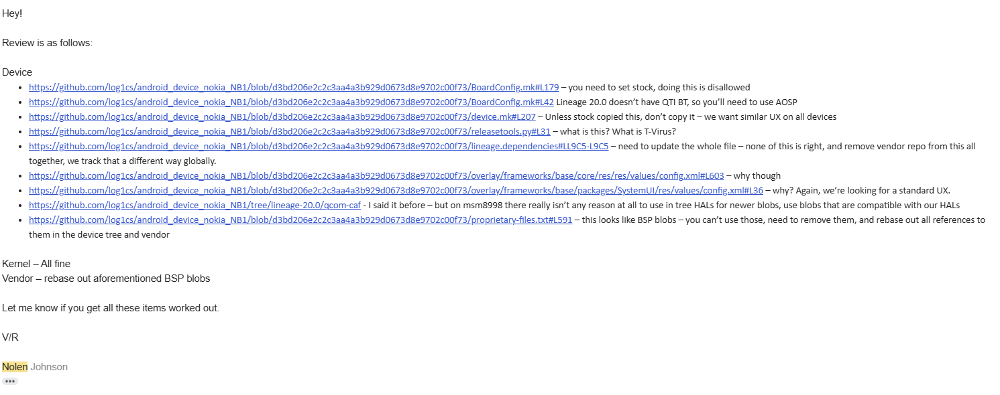

Thực ra thì sau 2 năm ở LineageOS, mình cũng khôn hơn nhiều so với trước :D

### Bonus
Nếu mọi người tò mò về việc dùng HAL cũ trên blobs Adreno mới thì, trông nó sẽ như thế này =))))))

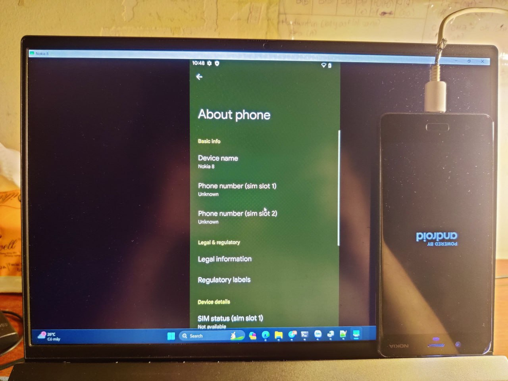

SDM sẽ ngỏm, mà SDM ngỏm thì HWC (hwcomposer) cũng sẽ ngỏm luôn. Từ đó thì RIP display output và nó sẽ chỉ kẹt hoài ở splash screen nhưng thực ra đã boot vào hệ thống rồi =))))))

SDM/HWC (hwcomposer) sẽ spam trong logcat:
```
01-01 08:10:57.613   685   685 E SDM     : CompManager::Prepare: Composition strategies exhausted for display = 0
01-01 08:10:57.613   685   685 E SDM     : HWCDisplay::PrepareLayerStack: Prepare failed. Error = 2
01-01 08:10:53.312   683   683 E HWComposer: getDeviceCompositionChanges: presentOrValidate failed for display 0: BadDisplay (2)
01-01 08:10:53.312   683   683 E CompositionEngine: chooseCompositionStrategy failed for Primary display: -2147483648 (Unknown error -2147483648)
```

## Việc thứ ba: Fix WLAN tethering
Trước khi đọc phần này, bạn cần hiểu [HIDL](https://source.android.com/docs/core/architecture/hidl) và [AIDL](https://source.android.com/docs/core/architecture/aidl/aidl-hals) HAL là gì.

Tethering là chế độ cho phép bạn chia sẻ Internet (gọi luôn cho gọn là Hotspot).

QPR = Quarterly Platform Release. Tìm hiểu thêm tại [đây](https://innogyan.in/2024/08/25/android-qpr-beta-vs-major-android-beta/).

Từ sau Android 14 QPR2, HIDL Wi-Fi đã không còn tồn tại trong source code nên mình đã chuyển sang AIDL variant của nó tại change [này](https://github.com/nokia-msm8998/android_device_nokia_msm8998-common/commit/407571ae07d6cc55738866620b142d9a8121aba3).

Nhưng vấn đề là, khi ở 14 QPR1 thì mọi thứ vấn đang rất bình thường, nhưng lên 14 QPR2, sau khi chuyển qua AIDL Wi-Fi thì đột nhiên hotspot lại không hoạt động nữa. Mở logcat lên đọc thì thấy:

```
servicemanager: Since 'android.hardware.wifi.supplicant.ISupplicant/default' could not be found (requested by debug pid 1646), trying to start it as a lazy AIDL service. (if it's not configured to be a lazy service, it may be stuck starting or still starting).
```

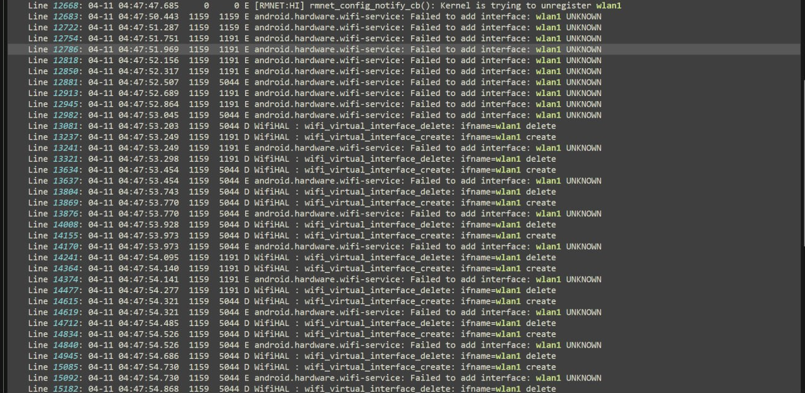

Trace `dmesg` lúc bootup, chúng ta thấy kernel không `ioctl` (open) được `wlan1`:
```
07-18 16:59:46.533  1032  1032 I netd    : interfaceSetCfg(InterfaceConfigurationParcel{ifName: wlan1, hwAddr: , ipv4Addr: 0.0.0.0, prefixLength: 0, flags: []}) -> ServiceSpecificException(19, "[No such device] : ioctl() failed") <0.15ms>
```

Hoặc check logcat ta thấy được:
```
05-05 15:56:55.081     0     0 E         : Cannot create concurrent STA interface
```

Thực ra thì mình cũng đã strace `hostapd` service nhưng cũng chả có gì bất thường lắm.

Để mình giải thích thêm: Nếu bạn bật Wi-Fi, thì kernel sẽ tạo ra node `/dev/wlan0` (còn sau đó bạn kết nối WLAN thì hệ thống sẽ write vào cái node đấy thôi). Nhưng nếu bạn muốn phát Wi-Fi mà vẫn sử dụng Wi-Fi trên thiết bị của mình (cụ thể là concurrent STA mode), thì bạn cần 1 interface WLAN nữa để bật hotspot song song với WLAN -> từ đó bạn có thể vừa dùng WLAN trên thiết bị của mình, vừa phát cho người khác sử dụng.

Và bằng 1 cách thần kì nào đó `wlan1` lại báo không thể add interface và mình không thể bật được hotspot lên sau QPR2 merge.

Mình không còn giữ ảnh nữa, nhưng mà 1 [người bạn](https://github.com/Niemandausduisburg) nữa bên Đức cũng cùng mình dev chiếc Nokia này nên mình vẫn có bức ảnh lúc nó báo fail và tắt luôn các WLAN interfaces + báo fail nên không thể bật hotspot lên được.

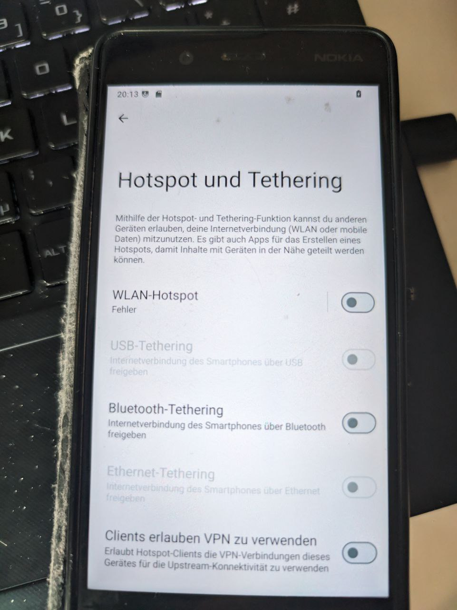

Thật may là cái gì cũng có cách fix, còn cách fix có trông oách xà lách hay không thôi :D

### Addressing the issue
Thực ra là mình đã chuẩn bị từ bỏ việc fix hotspot và chuẩn bị drop support cho chiếc Nokia này trong khoảng thời gian đó, nhưng trong lúc đó khi ông bạn dev cùng kia đã thử mọi thứ để có thể fix WLAN tethering.

Bọn mình đã thử ngó qua [WLAN configs](https://github.com/nokia-msm8998/android_device_nokia_msm8998-common/tree/lineage-22.1/configs) và thậm chí đã bring back cả HIDL Wi-Fi HAL, nhưng vẫn không bật được Hotspot lên.

Chúng mình đã thử vài tag [fw-api](https://git.codelinaro.org/clo/la/platform/vendor/qcom-opensource/wlan/fw-api), [qca-wifi-host-cmn](https://git.codelinaro.org/clo/la/platform/vendor/qcom-opensource/wlan/qca-wifi-host-cmn) và [qcacld-3.0](https://git.codelinaro.org/clo/la/platform/vendor/qcom-opensource/wlan/qcacld-3.0) - đây đều là những wireless driver của Qualcomm SoC, trừ khi OEM bạn dùng chip WLAN khác thì driver có thể khác thôi, ví dụ như chiếc LG V20 sử dụng Bluetooth/WLAN module của Broadcom nên họ không dùng qcacld.

LineageOS đang dùng `qcacld-3.0` của Android P cho kernel msm-4.4 common của họ (CLO tag `LA.UM.7.2.c25-07700-sdm660.0`). Lí do sử dụng tag này là vì P tag sẽ có độ tương thích cao với các thiết bị cũ, vì đã có nhiều report về việc sử dụng Q qcacld trên các thiết bị cũ sẽ gây ra vấn đề về WLAN performance (bad performance, bị nerf upload speed, blah blah...) nên họ vẫn lựa chọn ở lại `LA.UM.7.2` vì tag này có tương thích cao với cả những thiết bị SDM660/MSM8998 mới và cũ. Thực ra Nokia 8 vẫn có thể bật được hotspot bình thường ở các phiên bản Android cũ hơn 14 QPR1, nhưng bằng 1 cách thần kì nào đó thì nó lại không thể bật được Hotspot ở trên 14 QPR2 nữa, ảo ma Canada luôn.

Thật may là khi mình thử đến tag `LA.UM.8.4.r1-06200-8x98.0` thì Hotspot hoạt động trở lại. Đây là 1 tag Android Q của platform `msm8998`. Mình cũng chưa nghĩ đến việc thử đến Q qcacld vì trước giờ mọi thứ mình nghe về nó đều là tệ. Chả là bỗng một hôm đẹp trời, khi mình lướt qua kernel của lge-msm8998 (LG V30/LG G7 One) thì thấy họ sử dụng Q qcacld mà tag này chưa thử nên mình làm quả được ăn cả ngã về không luôn, nhưng mà thế quái nào lại bật được hotspot =)))))))))))))))))))

Bạn có thể check thêm ở repo [này](https://github.com/LineageOS/android_kernel_lge_msm8998/commits/lineage-22.1/drivers/staging).


Nếu bạn có làm trong scene Homebrew của Nintendo 3DS, thì chắc bạn có thể sẽ biết đến [lifehackerhansol](https://github.com/lifehackerhansol). Cha này là người đã [hồi sinh](https://www.phonearena.com/news/the-lg-v30-lives-again-through-official-lineage-os-support_id145953) chiếc LG V30 tại LineageOS sau khi nó đã bị drop sau thời CyanogenMod 14.1. Sau này thì mình có dịp được bringup [lge-sdm845](https://github.com/lge-sdm845) (mình bringup chiếc LG V40 ThinQ - `judypn`) và [lge-sm8150](https://github.com/lge-qcom-dev) (mình bringup LG G8 bản Mỹ - codename `alphalm`) thì mình có được bringup cùng với đại ca này. Đại ca này có đủ full gần như mọi con smartphone của LG trên cái Trái Đất này luôn, không thiếu con nào.

Hiện tại mình đang bringup [lge-sm7250](https://github.com/lge-sm7250) (LG Velvet, Wing) với sếp này, và [sony-sm8450](https://github.com/sony-nagara) nữa.

Back to work again.

Sau khi rebuild kernel và flash vào máy, thì Hotspot cuối cùng cũng bật lên. Nhưng, như mình đã nói ở trên, Q qcacld rất tệ, và đã có nhiều người nói về performance issues trên tag này. Và mình cũng không phải là ngoại lệ:

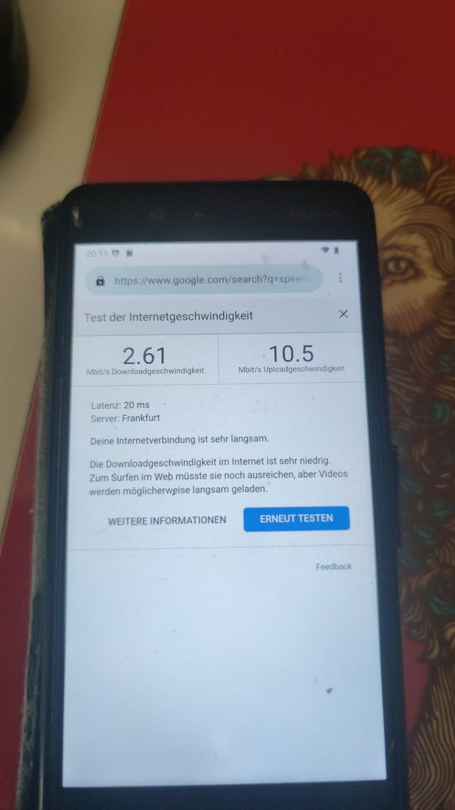

### Patching modem image
Nhưng bạn có nhớ rằng, trong family của nokia-msm8998, có 2 thiết bị MSM8998 không? Thật kì lạ khi chiếc Nokia 8 bị vấn đề liên quan đến WLAN speed, thì mình cũng làm 1 build cho chiếc Nokia 8 Sirocco. Thật lạ là chiếc 8 Sirocco lại có thể peak max speed của MSM8998 ở band 5GHz, trong khi chiếc 8 thì chỉ lác đác 2 hoặc 3 Mbps. 

Mình sực nhớ đến modem image, trong đó có chứa firmware của từng component trong thiết bị mà?

Đúng vậy, những gì mình đã làm là lấy modem của chiếc 8 Sirocco, vì chiếc này có Q update nên modem của nó cũng sẽ được update theo BSP luôn, mình unpack hết ra và replace WLAN firmware của chiếc 8 Sirocco (cụ thể là `wlanmdsp.mbn`) và bỏ vào modem của chiếc 8, sau đó nạp lại qua Fastboot. Check lại hotspot và WLAN thì tốc độ giờ đã về bình thường.

### Result
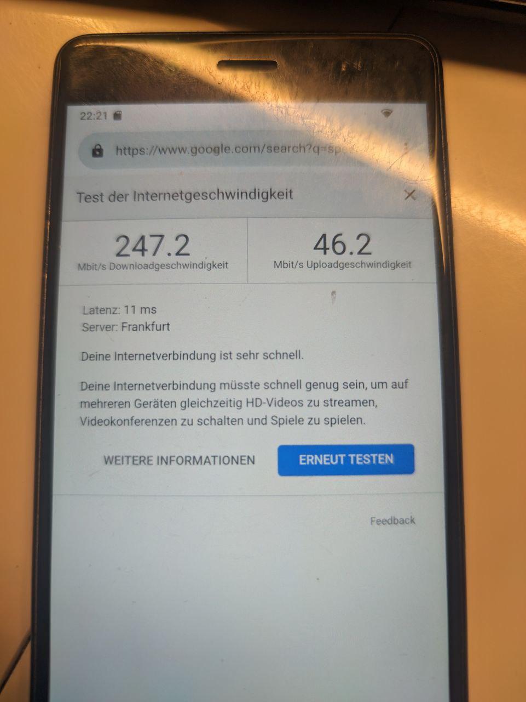

Để sau này khi người ta cài ROM mà không phải flash WLAN firmware thủ công nữa, nên mình đã dump luôn cái modem image mà mình đã modified ra và pin nó bằng sha1sum để lần sau khi mình chạy extract script thì nó sẽ không overwrite cái modem image của mình nữa.

Để pin 1 modified blob với LineageOS [extract-utils](https://github.com/LineageOS/android_tools_extract-utils/), bạn chỉ cần append `|<sha1sum>` kề cái blob đó là được, lúc giải nén thì utils sẽ check sha1sum của blob xem có match với cái modified blob đó không, nếu lệch thì sẽ giải nén blob đó từ stock firmware (unmodified) ra, còn nếu match thì sẽ skip giải nén blob đó.

Bạn có thể check commit reference tại [đây](https://github.com/nokia-msm8998/android_device_nokia_NB1/commit/be1a4c129d7a13547df4616b39a1ca3b7c449eff).

```
# Modem - with A1N_sprout Q WLAN firmware - 00WW_5_14L
modem.img;AB|d7ca8cdf46a702d5f844581504ccae9c965e7190
```

Lúc extract từ OTA ra thì script sẽ không overwrite bằng modem từ stock firmware nữa:
```
$ ./extract-files.py ../../../dumps/nb1/ --only-target
Parsing device/nokia/NB1/proprietary-firmware.txt
Parsing device/nokia/NB1/proprietary-files.txt
Using source dump dir ../../../dumps/nb1/
Backing up device/nokia/NB1/proprietary-firmware.txt
Backed up modem.img
Backing up device/nokia/NB1/proprietary-files.txt
Backed up vendor/lib64/libfp_client.so
Processing device/nokia/NB1/proprietary-firmware.txt
modem.img: restored pinned file with hash d7ca8cdf46a702d5f844581504ccae9c965e7190
```

Và đó là cách mình đã fix được WLAN Tethering trên chiếc máy 8 năm tuổi này. Cũng nhọc phết chứ không phải đùa, mình đã suýt từ bỏ nhiều lần rồi nhưng mà ông bạn kia hăng quá nên mình có thêm động lực để fix nó triệt để luôn. Mặc dù fix có vẻ cũng không chi tiết và hơi kiểu "kiến thức cá nhân" xíu, mong mọi người bỏ qua cho :D

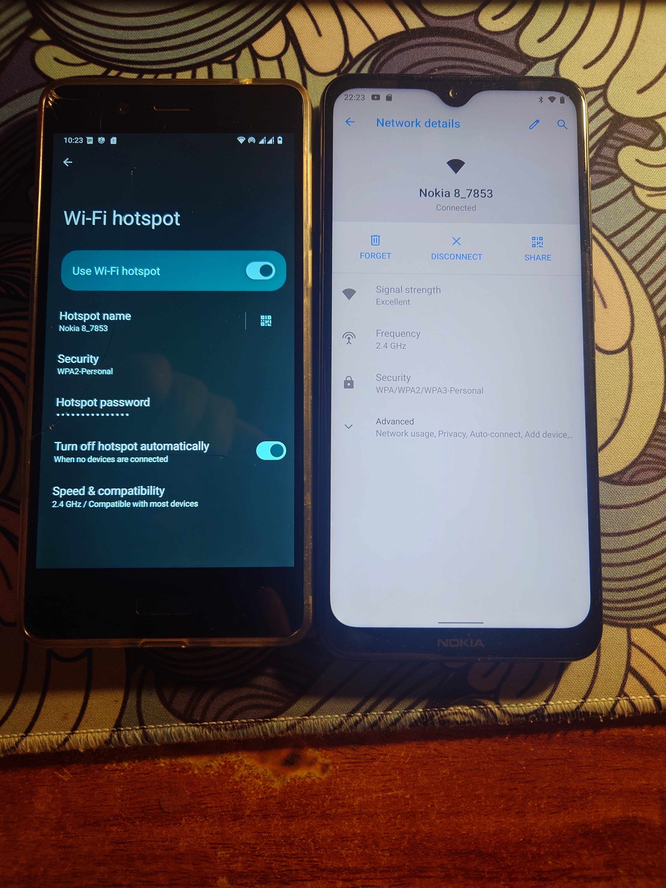

## Việc thứ tư: Prebuilt ELF check
Nếu bạn đã từng chơi CTF, chắc hẳn bạn cũng biết ELF là gì. Đúng, Android cũng sử dụng ELF cho những prebuilt libraries và services.

Vậy [Prebuilt ELF check](https://source.android.com/docs/core/architecture/vndk/abi-use-check) là gì? Tại sao nó lại cần thiết?

Nói đơn giản là thế này nhé, nếu 1 library depends trên những shared library khác, nhưng bạn lại skip ELF check, thì khi extract ra tỉ lệ bạn bị miss shared library là rất cao. Cụ thể là bạn sẽ dính các lỗi liên quan đến `dlopen()` hoặc `CANNOT LINK EXECUTABLE`.

Ví dụ như sau:
```
04-15 21:12:47.685  1057  1057 F linker  : CANNOT LINK EXECUTABLE "/vendor/bin/hw/vendor.nxp.hardware.nfc@1.2-service": library "vendor.nxp.hardware.nfc@1.0.so" not found: needed by main executable
07-11 15:31:47.962  3094  3094 E ims_media_jni: Error loading library lib-imsvt.so: dlopen failed: library "libqdMetaData.so" not found: needed by /system/system_ext/lib64/lib-imsvideocodec.so in namespace clns-shared-7
```

Hoặc library không thể tìm thấy symbol:
```
09-14 20:12:22.237  2587  2587 E ims_media_jni: Error loading library lib-imsvt.so: dlopen failed: cannot locate symbol "getMetaData" referenced by "/system/system_ext/lib64/lib-imsvideocodec.so"...
```

ELF check được sinh ra để giải quyết toàn bộ việc đó. Nó sẽ quét hết tất cả các symbol trong 1 file ELF có tồn tại không và check xem dependencies nào cần thiết để library đó hoạt động và build target đó trong lúc check ELF luôn. Hoặc check soname xem có trùng với cả tên library không.

Nói qua dạng văn bản thì chắc mọi người không hiểu, để mình ví dụ luôn cho mọi người dễ hiểu nhé.

### Giải quyết các ELF check fail vì không tìm thấy dependencies, hoặc target không tồn tại ở Blueprint format
Lấy ví dụ luôn, cho 1 ELF có filename là `vendor.qti.gnss@4.0-service.so`, nằm trong `/vendor/lib64`.

Nếu mọi người readelf nó ra, thì mọi người sẽ thấy được các shared libraries cần thiết để ELF này hoạt động bình thường:

```
$ readelf -d vendor.qti.gnss@4.0-service.so

Dynamic section at offset 0x5018 contains 45 entries:
  Tag        Type                         Name/Value
 0x0000000000000001 (NEEDED)             Shared library: [liblog.so]
 0x0000000000000001 (NEEDED)             Shared library: [libcutils.so]
 0x0000000000000001 (NEEDED)             Shared library: [libbase.so]
 0x0000000000000001 (NEEDED)             Shared library: [libutils.so]
 0x0000000000000001 (NEEDED)             Shared library: [libgps.utils.so]
 0x0000000000000001 (NEEDED)             Shared library: [libqti_vndfwk_detect.so]
 0x0000000000000001 (NEEDED)             Shared library: [libhidlbase.so]
 0x0000000000000001 (NEEDED)             Shared library: [android.hardware.gnss@1.0.so]
 0x0000000000000001 (NEEDED)             Shared library: [android.hardware.gnss@1.1.so]
 0x0000000000000001 (NEEDED)             Shared library: [android.hardware.gnss@2.0.so]
 0x0000000000000001 (NEEDED)             Shared library: [vendor.qti.gnss@1.0.so]
 0x0000000000000001 (NEEDED)             Shared library: [vendor.qti.gnss@1.1.so]
 0x0000000000000001 (NEEDED)             Shared library: [vendor.qti.gnss@1.2.so]
 0x0000000000000001 (NEEDED)             Shared library: [vendor.qti.gnss@2.0.so]
 0x0000000000000001 (NEEDED)             Shared library: [vendor.qti.gnss@2.1.so]
 0x0000000000000001 (NEEDED)             Shared library: [vendor.qti.gnss@3.0.so]
 0x0000000000000001 (NEEDED)             Shared library: [vendor.qti.gnss@4.0.so]
 0x0000000000000001 (NEEDED)             Shared library: [libc++.so]
 0x0000000000000001 (NEEDED)             Shared library: [libc.so]
 0x0000000000000001 (NEEDED)             Shared library: [libm.so]
 0x0000000000000001 (NEEDED)             Shared library: [libdl.so]
 0x000000000000000e (SONAME)             Library soname: [vendor.qti.gnss@4.0-service.so]
```

Nếu bình thường không có ELF check, bạn sẽ phải ngồi `readelf -d <blobname>` hoặc dùng [aosp-missing-blobs](https://github.com/joshchoo/aosp-missing-blobs) để ngồi mò từng cái shared library mà build thủ công trong device makefile.

Fear not, ELF check sinh ra để giải quyết vấn đề đó. Bằng cách define tát cả các library trong blueprint, mọi dependencies được define dưới dạng blueprint ở trong source sẽ đều được build!

Android.bp

```
cc_prebuilt_library_shared {
    name: "vendor.qti.gnss@4.0-service",
    owner: "nokia",
    strip: {
        none: true,
    },
    target: {
        android_arm64: {
            srcs: [
                "proprietary/vendor/lib64/vendor.qti.gnss@4.0-service.so",
            ],
            shared_libs: [
                "liblog",
                "libcutils",
                "libbase",
                "libutils",
                "libgps.utils",
                "libqti_vndfwk_detect",
                "libhidlbase",
                "android.hardware.gnss@1.0",
                "android.hardware.gnss@1.1",
                "android.hardware.gnss@2.0",
                "vendor.qti.gnss@1.0",
                "vendor.qti.gnss@1.1",
                "vendor.qti.gnss@1.2",
                "vendor.qti.gnss@2.0",
                "vendor.qti.gnss@2.1",
                "vendor.qti.gnss@3.0",
                "vendor.qti.gnss@4.0",
                "libc++",
                "libc",
                "libm",
                "libdl",
            ],
        },
    },
    compile_multilib: "64",
    prefer: true,
    soc_specific: true,
}
```

Nói nôm na là vậy, giờ chúng ta sẽ nói qua về các lỗi mình đã gặp trong lúc bật ELF check ở nokia-msm8998.

Đầu tiên là các blobs SDM của Adreno, chúng dựa vào `libsdmutils` nhưng target này lại được define [ở dạng Makefile](https://github.com/LineageOS/android_hardware_qcom_display/blob/lineage-21.0-caf-msm8998/sdm/libs/utils/Android.mk) trong display HAL, hoặc `libsdedrm` thì depends vào `libdrmutils`, cũng là 1 [target Makefile](https://github.com/LineageOS/android_hardware_qcom_display/blob/lineage-21.0-caf-msm8998/libdrmutils/Android.mk) - mà ELF check chỉ có thể pick up các dependencies dưới dạng blueprint thôi.

Tạm thời mình sẽ [disable ELF check](https://github.com/nokia-msm8998/android_device_nokia_msm8998-common/commit/8559934b8616f0ecfc8e066b7f4461ce3086dcca) cho bọn này, đợi bao giờ 2 target kia qua blueprint rồi thì mình bật lại sau.

Note luôn vào cho dễ track sau này.

```
# Current libraries with ELF checks disabled:
# libsdm-disp-vndapis, libsdm-color, libsdm-diag, libsdmextension depends on libsdmutils, which is a GNU Makefile target
# libsdedrm depends on libdrmutils, which is a GNU Makefile target

# Graphics (SDM) - from A1N_sprout - QKQ1.190828.002
vendor/lib/libsdm-disp-vndapis.so;DISABLE_CHECKELF|15a98ef885dbd29935b1107d7a2988ae495abb87
vendor/lib64/libqseed3.so|24ae4dfe5d9fa27a858b64dfafd1c713da6e6fde
vendor/lib64/libsdedrm.so;DISABLE_CHECKELF|8df03ed75d59ad0ae25dd1daa5ba9298a0e4d9ae
vendor/lib64/libsdm-color.so;DISABLE_CHECKELF|ed022cfcc1546c11b82991986e0a938464400858
vendor/lib64/libsdm-diag.so;DISABLE_CHECKELF|6eb99b83036f917070393fa067eaebc50a5ff307
vendor/lib64/libsdm-disp-vndapis.so;DISABLE_CHECKELF|ba4978c373f9892d884d07c4cf25dba9d73fda1f
vendor/lib64/libsdmextension.so;DISABLE_CHECKELF|69028df8b08ded29b835453b84e9a9c4fea958d1
vendor/lib64/libtinyxml2_1.so|ba981e332895a053a67fc54a8190365a3ad37f2d
```

Sau này thì 2 dependencies đó đã qua blueprint rồi, chúng nằm ở topic [này](https://review.lineageos.org/q/project:LineageOS/android_hardware_qcom_display+branch:lineage-22.1-caf-msm8998) nên mình đã revert nó ở [đây](https://github.com/nokia-msm8998/android_device_nokia_msm8998-common/commit/daf74151a9f6018d636b311c181ae5a2bd3d6572) rồi.

Bạn có thể check thêm ở [LineageOS Gerrit](https://review.lineageos.org/) để tìm hiểu thêm về các dependencies đã được convert qua blueprint format.

Giờ bạn đó cái nhìn tổng quát về ELF check với các shared libraries, bạn có thể tham khảo commit history của mình ở [đây](https://github.com/nokia-msm8998/android_device_nokia_msm8998-common/commits/lineage-22.1/proprietary-files.txt) để xem các changes của mình chứ ngồi viết cách mình fix ELF check cho từng blobs stack ra có mà hết Tết :D

### Resolvable symbols ELF check
Bạn biết các symbol lúc bạn export 1 ELF nào đó từ Ghidra ra code C không? Chính xác là nó đấy, và ELF check sẽ kiểm tra từng symbol ở đó xem có symbol nào bị thiếu không, và nếu thiếu chỉ 1 symbol thôi thì nó sẽ auto báo ELF check failed cho cái library đó luôn.

Lần này lấy ví dụ cho mọi người 2 blobs luôn. 1 cái là mình có thể resolve được, và 1 cái là có thể resolve được nhưng sẽ rất khó để fix, gọi luôn là non-resolvable.

Đầu tiên chúng ta sẽ lấy `libvendor.goodix.hardware.fingerprintextension@1.0.so` ra làm ví dụ (library này nằm trong chiếc 8 Sirocco), nó nằm trong `vendor/lib64`.

Khi build mà bật ELF check lên, khi check qua prebuilt ELF mà bị thiếu symbol, build system sẽ báo lỗi như sau:
```
[ 76% 13406/17446 8m21s remaining] Check prebuilt ELF binary: out/soong/.intermediates/vendor/nokia/A1N/libvendor.goodix.hardware.fingerprintextension@1.0/android_vendor_arm64_armv8-a_shared/libvendor.goodix.hardware.fingerprintextension@1.0.so
FAILED: out/target/product/A1N/obj/SHARED_LIBRARIES/libvendor.goodix.hardware.fingerprintextension@1.0_intermediates/check_elf_files.timestamp
/bin/bash -c "(rm -f out/target/product/A1N/obj/SHARED_LIBRARIES/libvendor.goodix.hardware.fingerprintextension@1.0_intermediates/check_elf_files.timestamp ) && (out/host/linux-x86/bin/check_elf_file 	    --skip-bad-elf-magic 	    --skip-unknown-elf-machine 	     	    --soname libvendor.goodix.hardware.fingerprintextension@1.0.so 	    --shared-lib out/target/product/A1N/obj/SHARED_LIBRARIES/libutils.vendor_intermediates/libutils.vendor.so --shared-lib out/target/product/A1N/obj/SHARED_LIBRARIES/libcutils.vendor_intermediates/libcutils.vendor.so --shared-lib out/target/product/A1N/obj/SHARED_LIBRARIES/liblzma.vendor_intermediates/liblzma.vendor.so --shared-lib out/target/product/A1N/obj/SHARED_LIBRARIES/libc.vendor_intermediates/libc.vendor.so --shared-lib out/target/product/A1N/obj/SHARED_LIBRARIES/libbase.vendor_intermediates/libbase.vendor.so --shared-lib out/target/product/A1N/obj/SHARED_LIBRARIES/libhardware.vendor_intermediates/libhardware.vendor.so --shared-lib out/target/product/A1N/obj/SHARED_LIBRARIES/libprotobuf-cpp-lite-vendorcompat_intermediates/libprotobuf-cpp-lite-vendorcompat.so --shared-lib out/target/product/A1N/obj/SHARED_LIBRARIES/libcrypto.vendor_intermediates/libcrypto.vendor.so --shared-lib out/target/product/A1N/obj/SHARED_LIBRARIES/liblog.vendor_intermediates/liblog.vendor.so --shared-lib out/target/product/A1N/obj/SHARED_LIBRARIES/libhidlbase.vendor_intermediates/libhidlbase.vendor.so --shared-lib out/target/product/A1N/obj/SHARED_LIBRARIES/libhidltransport.vendor_intermediates/libhidltransport.vendor.so --shared-lib out/target/product/A1N/obj/SHARED_LIBRARIES/libhwbinder.vendor_intermediates/libhwbinder.vendor.so --shared-lib out/target/product/A1N/obj/SHARED_LIBRARIES/android.hidl.base@1.0.vendor_intermediates/android.hidl.base@1.0.vendor.so --shared-lib out/target/product/A1N/obj/SHARED_LIBRARIES/libvndksupport.vendor_intermediates/libvndksupport.vendor.so --shared-lib out/target/product/A1N/obj/SHARED_LIBRARIES/android.hardware.keymaster@3.0.vendor_intermediates/android.hardware.keymaster@3.0.vendor.so --shared-lib out/target/product/A1N/obj/SHARED_LIBRARIES/libm.vendor_intermediates/libm.vendor.so --shared-lib out/target/product/A1N/obj/SHARED_LIBRARIES/libc++.vendor_intermediates/libc++.vendor.so --shared-lib out/target/product/A1N/obj/SHARED_LIBRARIES/libdl.vendor_intermediates/libdl.vendor.so 	    --system-shared-lib libc --system-shared-lib libm --system-shared-lib libdl 	     	    --llvm-readobj=prebuilts/clang/host/linux-x86/clang-r530567/bin/llvm-readobj 	    out/soong/.intermediates/vendor/nokia/A1N/libvendor.goodix.hardware.fingerprintextension@1.0/android_vendor_arm64_armv8-a_shared/libvendor.goodix.hardware.fingerprintextension@1.0.so ) && (touch out/target/product/A1N/obj/SHARED_LIBRARIES/libvendor.goodix.hardware.fingerprintextension@1.0_intermediates/check_elf_files.timestamp )"
out/soong/.intermediates/vendor/nokia/A1N/libvendor.goodix.hardware.fingerprintextension@1.0/android_vendor_arm64_armv8-a_shared/libvendor.goodix.hardware.fingerprintextension@1.0.so: error: Unresolved symbol: _ZN7android8hardware7details17gBnConstructorMapE
out/soong/.intermediates/vendor/nokia/A1N/libvendor.goodix.hardware.fingerprintextension@1.0/android_vendor_arm64_armv8-a_shared/libvendor.goodix.hardware.fingerprintextension@1.0.so: error: Unresolved symbol: _ZN7android8hardware7details17gBsConstructorMapE
out/soong/.intermediates/vendor/nokia/A1N/libvendor.goodix.hardware.fingerprintextension@1.0/android_vendor_arm64_armv8-a_shared/libvendor.goodix.hardware.fingerprintextension@1.0.so: note:
out/soong/.intermediates/vendor/nokia/A1N/libvendor.goodix.hardware.fingerprintextension@1.0/android_vendor_arm64_armv8-a_shared/libvendor.goodix.hardware.fingerprintextension@1.0.so: note: Some dependencies might be changed, thus the symbol(s) above cannot be resolved.
out/soong/.intermediates/vendor/nokia/A1N/libvendor.goodix.hardware.fingerprintextension@1.0/android_vendor_arm64_armv8-a_shared/libvendor.goodix.hardware.fingerprintextension@1.0.so: note: Please re-build the prebuilt file: "out/soong/.intermediates/vendor/nokia/A1N/libvendor.goodix.hardware.fingerprintextension@1.0/android_vendor_arm64_armv8-a_shared/libvendor.goodix.hardware.fingerprintextension@1.0.so".
out/soong/.intermediates/vendor/nokia/A1N/libvendor.goodix.hardware.fingerprintextension@1.0/android_vendor_arm64_armv8-a_shared/libvendor.goodix.hardware.fingerprintextension@1.0.so: note:
out/soong/.intermediates/vendor/nokia/A1N/libvendor.goodix.hardware.fingerprintextension@1.0/android_vendor_arm64_armv8-a_shared/libvendor.goodix.hardware.fingerprintextension@1.0.so: note: If this is a new prebuilt file and it is designed to have unresolved symbols, add one of the following properties:
out/soong/.intermediates/vendor/nokia/A1N/libvendor.goodix.hardware.fingerprintextension@1.0/android_vendor_arm64_armv8-a_shared/libvendor.goodix.hardware.fingerprintextension@1.0.so: note:   Android.bp: allow_undefined_symbols: true,
out/soong/.intermediates/vendor/nokia/A1N/libvendor.goodix.hardware.fingerprintextension@1.0/android_vendor_arm64_armv8-a_shared/libvendor.goodix.hardware.fingerprintextension@1.0.so: note:   Android.mk: LOCAL_ALLOW_UNDEFINED_SYMBOLS := true
```

Nhìn vào build log, bạn có thể thấy được symbol `_ZN7android8hardware7details17gBsConstructorMapE` không thể resolve được. Nhưng nếu bạn đã từng bringup Android 10 hoặc 11, thì đây là symbol của 1 target VNDK, cụ thể ở đây là `libhidlbase-v32`.
Và cụ thể hơn nữa một symbol [VNDK](https://source.android.com/docs/core/architecture/vndk) mà thiếu thì cái library đó chắc chắn không thể hoạt động được.

Nếu bạn search symbol này ở trên GitHub search, sẽ thấy rất nhiều commit workaround cho vấn đề của chúng ta. Chẳng hạn như ở [đây](https://github.com/ProjectElixir-Devices/device_google_taimen/commit/978392e5d02d3002249951557fb1103ec3306129).

```
From 978392e5d02d3002249951557fb1103ec3306129 Mon Sep 17 00:00:00 2001
From: Bruno Martins <bgcngm@gmail.com>
Date: Mon, 27 Nov 2023 22:33:02 +0800
Subject: [PATCH] taimen: Use libhidlbase-v32 for select Android P blobs

To workaround the removal of gBn/sConstructorMap from libhidl just for
the blobs that call _ZN7android8hardware7details17gBnConstructorMapE
and/or _ZN7android8hardware7details17gBsConstructorMapE.

Change-Id: I2376734cefb9d63775bd4e82feca9c588cd191ac
```

Note: LineageOS có prebuilt libhidlbase-v32 dược [define dưới dạng blueprint](https://review.lineageos.org/c/LineageOS/android_hardware_lineage_compat/+/410388) trong `hardware/lineage/compat`, nên chúng ta không cần phải sử dụng `PRODUCT_COPY_FILES`.

Sử dụng patchelf để replace shared library `libhidlbase` thành `libhidlbase-v32` trong extract-files.py:
```
blob_fixups: blob_fixups_user_type = {
    'vendor/lib64/libvendor.goodix.hardware.fingerprintextension@1.0.so': blob_fixup()
        .replace_needed('libhidlbase.so', 'libhidlbase-v32.so'),
}  # fmt: skip
```

Sau đó thì chạy script lên và reextract lại blobs, thì lúc này utils sẽ return lại là blobs đã được patch rồi:
```
$ ./extract-files.py ../../../dumps/a1n/ --only-target
Parsing device/nokia/A1N/proprietary-files.txt
Using source dump dir ../../../dumps/a1n/
Processing device/nokia/A1N/proprietary-files.txt
vendor/lib64/libvendor.goodix.hardware.fingerprintextension@1.0.so: fixed up
```

Và shared dependencies cũng được update luôn:
```
cc_prebuilt_library_shared {
    name: "libvendor.goodix.hardware.fingerprintextension@1.0",
    owner: "nokia",
    strip: {
        none: true,
    },
    target: {
        android_arm64: {
            srcs: [
                "proprietary/vendor/lib64/libvendor.goodix.hardware.fingerprintextension@1.0.so",
            ],
            shared_libs: [
                "libutils",
                "libcutils",
                "liblzma",
                "libc",
                "libc++",
                "libbase",
                "libdl",
                "libhardware",
                "libprotobuf-cpp-lite-vendorcompat",
                "libkeymaster_messages",
                "libcrypto",
                "liblog",
                "libhidlbase-v32",                  // Trước đây là libhidlbase
                "libhidltransport",
                "libhwbinder",
                "android.hidl.base@1.0",
                "libvndksupport",
                "android.hardware.keymaster@3.0",
                "libm",
            ],
        },
    },
    compile_multilib: "64",
    prefer: true,
    soc_specific: true,
}             
```

Rebuild lại và cuối cùng thì build system cũng không còn than về việc missing symbols trên library này nữa, vậy là xong!

Trên chiếc Nokia 8 này thì mình chỉ phải resolve 1 vài missing symbol như `__android_log_print` (dùng để print log ra logcat), đã nằm trong `liblog` và có thể build từ source ra. Bạn có thể check thêm tại [đây](https://github.com/nokia-msm8998/android_device_nokia_NB1/commits/lineage-22.1/proprietary-files.txt).

Tóm gọn lại, bạn có thể resolve các missing symbol trong ELF check nếu:
- Bạn biết cách shim các ELF (nhưng nó phải chạy, chứ viết dummy shim thì tỉ lệ hẹo cao lắm). Mình sẽ nói rõ hơn về shim trong ELF ở một bài post khác.
- Tìm các prebuilt library, hoặc một dependencies nào đó có thể build từ source mà có chứa symbol bạn cần đến.

### Non-resolvable symbols ELF check
Cái này thì khoai hơn, vì thường các non-resolvable symbol thì toàn là các intrinsics symbol (kiểu symbol từ compiler add vào), và ở trên những compiler mới hơn thì các symbol đấy đều không thể resolve được (cụ thể hơn là có thể fix được, nhưng shim sẽ rất khó).

Chẳng hạn luôn, camera stack của chiếc Nokia 8 này có rất nhiều libraries từ thời Napoleon, nên khi build thì build system cũng làm mình phải ngồi vò đầu bứt tai rebuild mấy chục lần để pass full đống check đấy, tức voãi :D

```
[ 44% 46569/105615] Check prebuilt ELF binary: out/soong/.intermediates/vendor/nokia/NB1/libmmcamera2_mct/android_vendor_arm_armv8-a_shared/libmmcamera2_mct.so
FAILED: out/target/product/NB1/obj_arm/SHARED_LIBRARIES/libmmcamera2_mct_intermediates/check_elf_files.timestamp
/bin/bash -c "(rm -f out/target/product/NB1/obj_arm/SHARED_LIBRARIES/libmmcamera2_mct_intermediates/check_elf_files.timestamp ) && (out/host/linux-x86/bin/check_elf_file 	    --skip-bad-elf-magic 	    --skip-unknown-elf-machine 	     	    --soname libmmcamera2_mct.so 	    --shared-lib out/target/product/NB1/obj_arm/SHARED_LIBRARIES/liblog.vendor_intermediates/liblog.vendor.so --shared-lib out/target/product/NB1/obj_arm/SHARED_LIBRARIES/libcutils.vendor_intermediates/libcutils.vendor.so --shared-lib out/target/product/NB1/obj_arm/SHARED_LIBRARIES/libmmcamera_dbg_intermediates/libmmcamera_dbg.so --shared-lib out/target/product/NB1/obj_arm/SHARED_LIBRARIES/libc.vendor_intermediates/libc.vendor.so --shared-lib out/target/product/NB1/obj_arm/SHARED_LIBRARIES/libm.vendor_intermediates/libm.vendor.so --shared-lib out/target/product/NB1/obj_arm/SHARED_LIBRARIES/libc++.vendor_intermediates/libc++.vendor.so --shared-lib out/target/product/NB1/obj_arm/SHARED_LIBRARIES/libdl.vendor_intermediates/libdl.vendor.so 	    --system-shared-lib libc --system-shared-lib libm --system-shared-lib libdl 	     	    --llvm-readobj=prebuilts/clang/host/linux-x86/clang-r530567/bin/llvm-readobj 	    out/soong/.intermediates/vendor/nokia/NB1/libmmcamera2_mct/android_vendor_arm_armv8-a_shared/libmmcamera2_mct.so ) && (touch out/target/product/NB1/obj_arm/SHARED_LIBRARIES/libmmcamera2_mct_intermediates/check_elf_files.timestamp )"
out/soong/.intermediates/vendor/nokia/NB1/libmmcamera2_mct/android_vendor_arm_armv8-a_shared/libmmcamera2_mct.so: error: Unresolved symbol: __aeabi_d2lz
out/soong/.intermediates/vendor/nokia/NB1/libmmcamera2_mct/android_vendor_arm_armv8-a_shared/libmmcamera2_mct.so: error: Unresolved symbol: __aeabi_ldivmod
out/soong/.intermediates/vendor/nokia/NB1/libmmcamera2_mct/android_vendor_arm_armv8-a_shared/libmmcamera2_mct.so: error: Unresolved symbol: __aeabi_ul2d
out/soong/.intermediates/vendor/nokia/NB1/libmmcamera2_mct/android_vendor_arm_armv8-a_shared/libmmcamera2_mct.so: note:
out/soong/.intermediates/vendor/nokia/NB1/libmmcamera2_mct/android_vendor_arm_armv8-a_shared/libmmcamera2_mct.so: note: Some dependencies might be changed, thus the symbol(s) above cannot be resolved.
out/soong/.intermediates/vendor/nokia/NB1/libmmcamera2_mct/android_vendor_arm_armv8-a_shared/libmmcamera2_mct.so: note: Please re-build the prebuilt file: "out/soong/.intermediates/vendor/nokia/NB1/libmmcamera2_mct/android_vendor_arm_armv8-a_shared/libmmcamera2_mct.so".
out/soong/.intermediates/vendor/nokia/NB1/libmmcamera2_mct/android_vendor_arm_armv8-a_shared/libmmcamera2_mct.so: note:
out/soong/.intermediates/vendor/nokia/NB1/libmmcamera2_mct/android_vendor_arm_armv8-a_shared/libmmcamera2_mct.so: note: If this is a new prebuilt file and it is designed to have unresolved symbols, add one of the following properties:
out/soong/.intermediates/vendor/nokia/NB1/libmmcamera2_mct/android_vendor_arm_armv8-a_shared/libmmcamera2_mct.so: note:   Android.bp: allow_undefined_symbols: true,
out/soong/.intermediates/vendor/nokia/NB1/libmmcamera2_mct/android_vendor_arm_armv8-a_shared/libmmcamera2_mct.so: note:   Android.mk: LOCAL_ALLOW_UNDEFINED_SYMBOLS := true
```

`__aeabi_d2lz`, `__aeabi_ldivmod` và `__aeabi_ul2d` là các compiler symbol (cụ thể là `libc@PRIVATE`), thường được append vào bởi compiler. Thực ra thì việc shim để fix unresolved symbol cho những library này là có thể, nhưng mà nó sẽ rất khó để shim.

Nên solution mình đưa ra cho các library bị dính các intrinsic symbols là: [Disable ELF check](https://github.com/nokia-msm8998/android_device_nokia_NB1/commit/2bc7f9bef93b2fcc870038b5bdc7d0119bb2d7e7) cho library đó hoặc [xoá luôn các symbol đó đi](https://github.com/nokia-msm8998/android_device_nokia_NB1/commit/ca6a44ed119a4943e9b39192ff91d555d1e6303a).

ELF check thì cũng chí có vậy thôi, nó không khó nhưng thực sự lúc mới build để pass được cái check này bạn sẽ thấy rất là ức chế vì nó vô cùng tốn thời gian. Nhưng hiệu quả nó mang lại là rất lớn, giúp bạn có thể tìm ra được các missing dependencies mỗi lần rebuild để từ đó biết đường mà giải quyết, thay vì cứ rebuild, flash rồi lại boot up lên rồi mở logcat lên check thì sẽ còn tốn thời gian hơn :D

## Việc cuối cùng và nó chỉ xảy ra ở Android 15: sensors stack
Khi bringup xong chiếc máy này lên Android 15, bằng một cách thần kì mọi thứ đều hoạt động nhưng chỉ có duy nhất 1 thứ không hoạt động: sensors stack.

Sensors stack gánh vác các operation liên quan đến sensors trên thiết bị của bạn, cụ thể là trên Qualcomm, 1 sensor stack sẽ có các libraries/configurations sau:

```
# Sensors
vendor/bin/sensors.qti
vendor/lib/libsensor1.so
vendor/lib/libsensor_reg.so
vendor/lib/libsns_low_lat_stream_stub.so
vendor/lib/sensor_calibrate.so
vendor/lib/sensors.ssc.so
vendor/lib64/libsensor1.so
vendor/lib64/libsensor_reg.so
vendor/lib64/libsns_low_lat_stream_stub.so
vendor/lib64/sensor_calibrate.so
vendor/lib64/sensors.ssc.so

# Sensor configurations
vendor/etc/sensors/hals.conf
vendor/etc/sensors/sensor_def_qcomdev.conf
```

Nếu cho bạn một chiếc điện thoại mà nó không thể xoay ngang màn hình, bạn không điều chỉnh auto brightness được, hay bạn áp nó vào tai khi đang nghe điện thoại mà nó không tắt màn hình, liệu bạn có chấp nhận được không? Mình thì không :D

### Closer look
Mở Device Info HW lên, bạn sẽ thấy app report 0 sensors available:

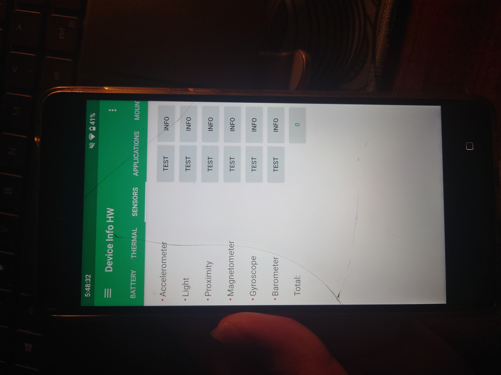

Dump tạm 1 cái logcat ra ngó xem có gì đặc biệt không, ta thấy được QMI spam liên tục (rate 20000 dòng/1 phút):

```
01-12 11:03:37.107  1200  1214 E QMI_FW  : xport_reg Failed for service_id=0x35 version=0x1001 on 9
```

Thực ra thì mình cũng chưa dính đến lỗi liên quan đến QMI bao giờ, nên mình làm ngơ đoạn này. Trông có vẻ liên quan đến `sec_config`.

Từ các thóng tin trên, ta phần nào giải thích được tại sao file log này lại dày thế =))))))


Đọc tiếp thì thấy `android.hardware.sensors@1.0` chưa được register trong manifest lúc khởi động, điều này chắc chắn là có vấn đề gì đó trong SensorsService trong lúc bootup rồi.

```
08-28 13:30:55.696   706   706 I hwservicemanager: Since android.hardware.sensors@1.0::ISensors/default is not registered, trying to start it as a lazy HAL (if it's not configured to be a lazy HAL, it may be stuck starting or still starting).
08-28 13:30:55.696  1535  1987 I HidlServiceManagement: getService: Trying again for android.hardware.sensors@1.0::ISensors/default...
```

Thực ra thì mình so sánh cả 2 cái service với nhau (1 cái ở Android 14, lúc nó hoạt động và 1 cái ở Android 15, lúc nó tạch) thông qua strace, và nó cũng chả có gì đặc sắc lắm.

Nếu bạn muốn strace của sensors stack thì có thể xem tại [đây](https://katb.in/cutitawocix). Ở Android 14 và 15 thì 2 cái strace này giống nhau hết, mình compare bằng Meld rồi :D

Mình bắt đầu tự hỏi rằng tại sao các thiết bị msm8998 khác không bị mà mỗi cái của mình lại bị. Nên lúc đó bằng 1 cách thần kì nào đấy mình lại nhớ đến Treble để có phân vùng `vendor` và tất cả các thiết bị đang được ship ở LineageOS đều có Treble, nên mình đã cài lại T-Virus, và cài thử tạm 1 build GSI của Android 15 lên trên đó. GSI boot bình thường và sensor stack hoạt động bình thường, auto rotate các kiểu hoạt động bình thường luôn, ảo thật =)))))))

Và rồi mình nghĩ ra trong đầu, liệu có phải do Android 15 kill support cho tất cả các thiết bị non-Treble không? Và cách xử lý như thế nào?

### Solving the problem
Plan của mình để support Treble cho chiếc máy này mà không cần phải repartition đó chính là: Retrofit Dynamic Partitions.

Dynamic Partitions là gì? Nếu bạn có 1 thiết bị được launch với Android 10, chắc hẳn nó phải support Dynamic Partitions (phải support chứ, Google enforces rồi mà). Concept của Dynamic Partitions sinh ra để giải quyết vấn đề thiếu dung lượng trong các phân vùng system/vendor/product/odm khi build OTA cho các thiết bị cũ.

Chẳng hạn như ngày xưa bạn có phân vùng `system` với 3GB, `vendor` với 1GB và `product` với 2GB, khi build 1 OTA mới cho thiết bị đó mà 1 phân vùng nào đó quá có size vượt ngưỡng định sẵn ban đầu, build sẽ fail ngay lập tức vì không đủ chỗ trống để nhét content vào đó. Với Dynamic Partitions, thì các phân vùng đó sẽ được gộp vào trong 1 khối phân vùng được gọi là `super`. Đại loại là nó sẽ hoạt động như sau:


Trong `super` sẽ chứa các phân vùng đó, và cho phép các phân vùng trong khối super đó được resize tuỳ ý. Bạn có thể thêm hoặc bớt phân vùng, chỉnh sửa kích thước phân vùng đó mà không phải lo hết dung lượng (chỉ cần không quá size của `super` là được), giúp cho việc support OTA update sẽ dễ dàng hơn rất nhiều.

Tìm hiểu thêm về Dynamic Partitions tại [đây](https://source.android.com/docs/core/ota/dynamic_partitions/implement).

Việc triển khai Retrofit Dynamic Partitions có thể giúp bạn thoải mái hơn trong việc support OTA cho các thiết bị cũ. Chẳng hạn như với các phân vùng được nêu trên, chẳng hạn khi build OTA bạn có phân vùng `system` còn trống nhiều dung lượng hoặc `vendor` cũng thế nhưng `product` lại hết mất dung lượng, thì RDP có thể giúp bạn gộp cả 3 phân vùng đó vào một khối phân vùng lớn và span data across 3 phân vùng đó luôn. Đại loại là giống kiểu phân vùng `super` ảo ấy vì mấy con máy cũ làm gì có phân vùng `super` đâu :D

Nó còn có thể mang Treble đến các thiết bị cũ hơn nếu muốn. Chẳng hạn như chiếc LG V30 cũng có setup non-Treble giống Nokia 8, chả qua nó là A-only nên phân vùng system của nó rất lớn (tận 6GB) nên chúng ta có thể [Retrofit mỗi phân vùng đó](https://github.com/LineageOS/android_device_lge_joan-common/blob/lineage-22.1/BoardConfigCommon.mk#L125) thôi và tạo ra thêm 5 phân vùng khác trong cái phân vùng system đó nữa để support proper Treble luôn.

### The state of A/B Retrofit Dynamic Partitions
Để support RDP trên A/B, chúng ta cần ít nhất 2 phân vùng để gộp vào, nếu không thì build system sẽ fail ngay lập tức. Nếu bạn đang không hiểu tại sao lại yêu cầu 2 phân vùng, thì có thể đọc tại [đây](https://github.com/LineageOS/android_build/blob/lineage-22.1/tools/releasetools/add_img_to_target_files.py#L807).

Giờ vấn đề là, tìm phân vùng nào để tận dụng khi chúng ta không có nhiều lựa chọn đây? Nhìn lại lên LUN0, bạn có thể thấy phân vùng `hidden` là phân vùng chứa Nokia USB driver, và trên AOSP thì nó khá là vô dụng (vì mình drop support mounting cái CD-ROM ở trong phân vùng `hidden` rồi). Chúng ta sẽ lấy cái phân vùng 40MB này làm cái để chúng ta bypass cái check "tối thiểu 2 phân vùng" cho RDP A/B.

Mình sẽ setup phân vùng như sau:
```
# Partitions
TARGET_COPY_OUT_SYSTEM := system
TARGET_COPY_OUT_SYSTEM_EXT := system_ext
TARGET_COPY_OUT_PRODUCT := product
TARGET_COPY_OUT_ODM := odm
BOARD_SYSTEMIMAGE_FILE_SYSTEM_TYPE := ext4
BOARD_VENDORIMAGE_FILE_SYSTEM_TYPE := ext4
BOARD_SYSTEM_EXTIMAGE_FILE_SYSTEM_TYPE := ext4
BOARD_PRODUCTIMAGE_FILE_SYSTEM_TYPE := ext4
BOARD_ODMIMAGE_FILE_SYSTEM_TYPE := ext4
BOARD_SUPER_PARTITION_BLOCK_DEVICES := system hidden
BOARD_SUPER_PARTITION_METADATA_DEVICE := system
BOARD_SUPER_PARTITION_SYSTEM_DEVICE_SIZE := 3727949824
BOARD_SUPER_PARTITION_HIDDEN_DEVICE_SIZE := 39059456
BOARD_SUPER_PARTITION_SIZE := $(shell expr $(BOARD_SUPER_PARTITION_SYSTEM_DEVICE_SIZE) + $(BOARD_SUPER_PARTITION_HIDDEN_DEVICE_SIZE))
BOARD_SUPER_PARTITION_GROUPS := nb1_dynamic_partitions
BOARD_NB1_DYNAMIC_PARTITIONS_SIZE := $(shell expr $(BOARD_SUPER_PARTITION_SIZE) - 4194304) # 4MiB overhead
BOARD_NB1_DYNAMIC_PARTITIONS_PARTITION_LIST := system_ext system vendor product odm
```

Giờ trong phân vùng system và hidden của mình sẽ chứa các phân vùng sau:
```
system + hidden
├── odm
├── product
├── system
├── system_ext
└── vendor
```

Và label nó trong sepolicy/file_contexts thành `u:object_r:system_block_device:s0`:

```
--- sepolicy/file_contexts
+++ sepolicy/file_contexts

# Partitions (A/B)
/dev/block/platform/soc/1da4000\.ufshc/by-name/system_[ab]                     u:object_r:system_block_device:s0
/dev/block/platform/soc/1da4000\.ufshc/by-name/hidden_[ab]                     u:object_r:system_block_device:s0
```

Và define type cho nó luôn:
```
--- sepolicy/file.te
+++ sepolicy/file.te

# Block devices
typeattribute system_block_device super_block_device_type;
```

Phải label các phân vùng này để sau này khi chúng ta update OTA, SELinux mới cho phép chúng ta install OTA lên các phân vùng đó, nếu không thì sau này lúc install OTA thì Updater sẽ báo lỗi vì không thể access các block devices để cài đặt OTA và `avc` sẽ spam trong logcat khi `update_engine_client` bắt đầu cài đặt OTA.

Đồng thời, chúng ta sẽ không extract và flash `hidden.img` từ stock firmware nữa. Đại loại tổng hợp của cái change này sẽ như sau, bạn có thể check tại [đây](https://review.lineageos.org/q/topic:%22lineage-22.1-nokia-msm8998%22,25):

```
From b0c71fbfa9457a00cd756a4b37edd76f561e0708 Mon Sep 17 00:00:00 2001
From: Tuan Anh <tuan73176@gmail.com>
Date: Thu, 23 Jan 2025 23:33:30 +0700
Subject: [PATCH] NB1: Setup Retrofit dynamic partitions

- Unlike A-only devices, A/B retrofit requires more than one partitions.
- /hidden is used to store Nokia USB drivers (the CD-ROM drive that mounted to your PC everytimes you connect
  the phone) and it's kinda useless on custom firmware. Take that as a dummy partition to build the super image,
  as we don't have any slotted partitions to reuse.
- Stop extracting /hidden firmware image, as we're now making the use of it.
- Explicitly copy fstab, corresponding common device tree changes Iad31ad55e68beb40448b1a10a9099c0ae44c3d44,
  and checkout fstab to the common device tree ones while at it.
- Adjust system partition size (total size of super must be divisible to BOARD_FLASH_BLOCK_SIZE)
- Build check_dynamic_partitions while at it.

Change-Id: Ic2f554bbe4cccfd3df5d726408d1c24b167aef90
```

Add thêm các change [này](https://review.lineageos.org/c/LineageOS/android_device_nokia_NB1/+/420616) và [này](https://review.lineageos.org/c/LineageOS/android_device_nokia_NB1/+/420616) sau đó [drop](https://github.com/nokia-msm8998/android_kernel_nokia_msm8998/commit/8e7938fb1e7240cd53d1fbb85eb63efd739cb62c) luôn node `firmware` trong DTS của kernel, vì giờ các phân vùng chứa Android sẽ đều được mount ở second stage init hết, cũng như cmdline đã giúp chúng ta avoid được việc dùng fstab trong DTS.

```
diff --git a/arch/arm64/boot/dts/fih/NB1_common/fih_memmap_nb1_evb.dtsi b/arch/arm64/boot/dts/fih/NB1_common/fih_memmap_nb1_evb.dtsi
index 44fa99fa1c5d..832482a46b5a 100644
--- a/arch/arm64/boot/dts/fih/NB1_common/fih_memmap_nb1_evb.dtsi
+++ b/arch/arm64/boot/dts/fih/NB1_common/fih_memmap_nb1_evb.dtsi
@@ -1,24 +1,6 @@
 /* ref: msm8998.dtsi */
 
 / {
-	firmware: firmware {
-		android {
-			boot_devices = "soc/1da4000.ufshc";
-			compatible = "android,firmware";
-			fstab {
-				compatible = "android,fstab";
-				vendor {
-					compatible = "android,vendor";
-					dev = "/dev/block/platform/soc/1da4000.ufshc/by-name/vendor";
-					type = "ext4";
-					mnt_flags = "ro,barrier=1,discard";
-					fsmgr_flags = "wait,slotselect";
-					status = "disabled";
-				};
-			};
-		};
-	};
-
 	reserved-memory {
 		fih_mem: fih_region@a0000000 { /* for FIH feature */
 			compatible = "removed-dma-pool";
```

Update fstab luôn cho RDP:
```
# Android fstab file.
# The filesystem that contains the filesystem checker binary (typically /system) cannot
# specify MF_CHECK, and must come before any filesystems that do specify MF_CHECK

# A/B fstab.qcom variant
#<src>                                   <mnt_point>        <type> <mnt_flags and options>                             <fs_mgr_flags>
system                                   /system               ext4   ro,barrier=1,discard                             wait,slotselect,logical,first_stage_mount
vendor                                   /vendor               ext4   ro,barrier=1,discard                             wait,slotselect,logical,first_stage_mount
system_ext                               /system_ext           ext4   ro,barrier=1,discard                             wait,slotselect,logical,first_stage_mount
product                                  /product              ext4   ro,barrier=1,discard                             wait,slotselect,logical,first_stage_mount
odm                                      /odm                  ext4   ro,barrier=1,discard                             wait,slotselect,logical,first_stage_mount
/dev/block/by-name/logdump               /metadata             ext4   nosuid,nodev,noatime,discard                     wait,check,formattable,first_stage_mount
/dev/block/bootdevice/by-name/userdata   /data                 ext4   noatime,nosuid,nodev,barrier=1,noauto_da_alloc,discard,lazytime,errors=panic   wait,check,latemount,formattable,fileencryption=ice,quota,reservedsize=128M
/dev/block/bootdevice/by-name/misc       /misc                 emmc   defaults                                         defaults
/dev/block/bootdevice/by-name/modem      /vendor/firmware_mnt  vfat   ro,shortname=lower,uid=0,gid=1000,dmask=227,fmask=337,context=u:object_r:firmware_file:s0 wait,slotselect
/dev/block/bootdevice/by-name/bluetooth  /vendor/bt_firmware   vfat   ro,shortname=lower,uid=1002,gid=3002,dmask=227,fmask=337,context=u:object_r:bt_firmware_file:s0 wait,slotselect
/dev/block/bootdevice/by-name/dsp        /vendor/dsp           ext4   ro,nosuid,nodev,barrier=1                        wait,slotselect
/dev/block/bootdevice/by-name/persist    /mnt/vendor/persist   ext4   noatime,nosuid,nodev,barrier=1                   wait

# Removeable
/devices/soc/c084000.sdhci/mmc_host*     auto               auto   defaults                                         wait,voldmanaged=sdcard1:auto,encryptable=userdata
/devices/*/xhci-hcd.0.auto*              auto               auto   defaults                                         voldmanaged=usb:auto

# ZRAM
/dev/block/zram0                         none        swap   defaults    zramsize=50%,max_comp_streams=8
```

Giờ có vẻ ổn rồi đấy, đến giờ rebuild rồi :D

Sau khi rebuild xong, chúng ta sẽ cần update recovery vì recovery cũ không hỗ trợ nạp OTA có chứa RDP. Nạp recovery mới và flash `super_empty` để tạo liên kết giữa 2 phân vùng này ở `fastbootd` sẽ giúp chúng ta có thể cài đặt OTA.

Sau khi cài đặt xong, chúng ta reboot thì sensors stack đã hoạt động trở lại, và cái QMI_FW logspam cũng bay màu luôn:

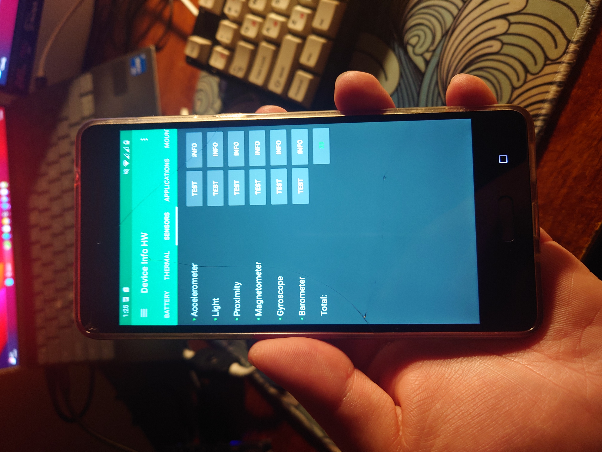

Vậy là suy đoán của mình đã đúng. Do Android 15 có thay đổi gì đó trong source code (có thể là họ drop support cho các thiết bị non-Treble, nên phân vùng `vendor` là thiết yếu trong Android 15) và chuyển sang Treble đã giải quyết được thành công vấn đề. Giờ thì bug list của mình đã thành fixed hết, và gần như là không còn gì để fix nữa, đợi Google release 15 QPR2 rồi fix tiếp lỗi của 15 QPR2 :D

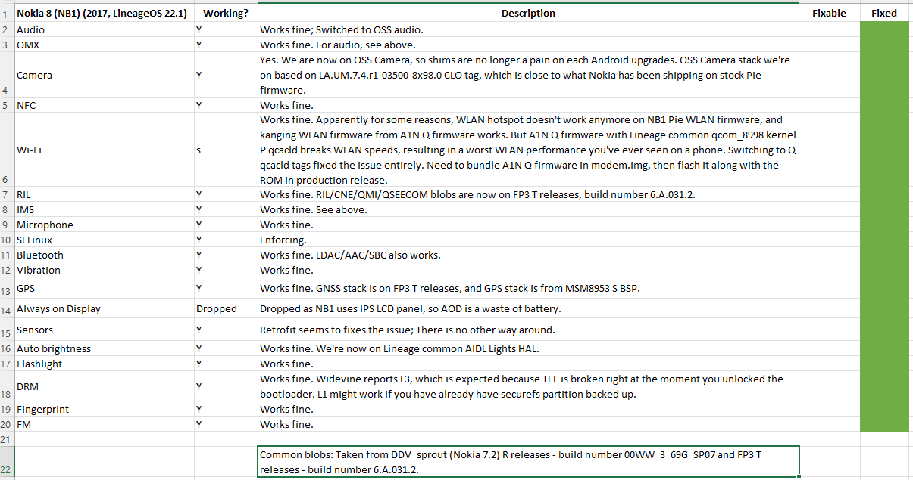

### Một vài screenshot khác của LineageOS 22.1 trên chiếc Nokia 8:

Đây là unofficial build và chỉ được sử dụng với mục đích testing. Hiện tại các changes đã được mình merge vào các repo tương ứng trên LineageOS Gerrit - bạn có thể check tại topic [này](https://review.lineageos.org/q/topic:%22lineage-22.1-nokia-msm8998%22), nhưng mà mình cần phải hoàn tất cái guide upgrade từ LineageOS 21 lên 22.1 cho nó đã, vì LineageOS 21 là non-RDP =)))))))

| | | |
|-|-|-|
|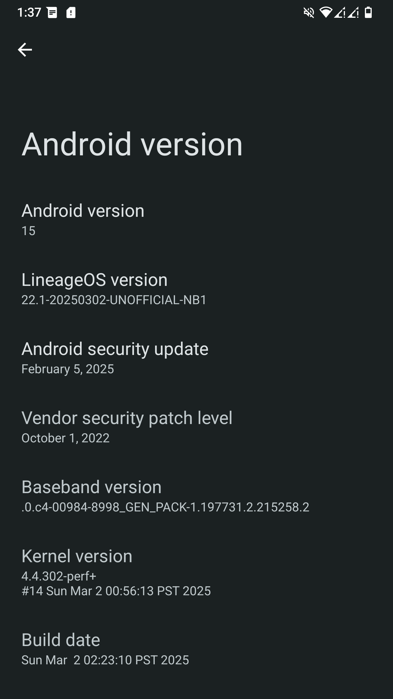 |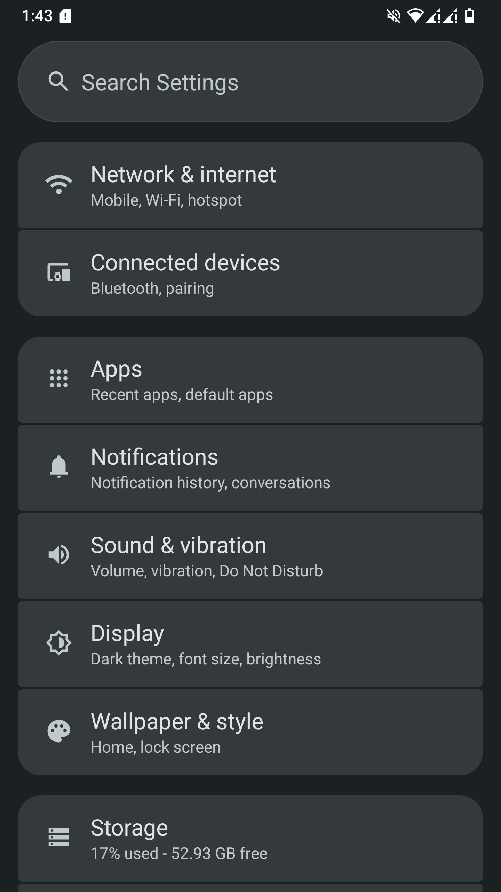 |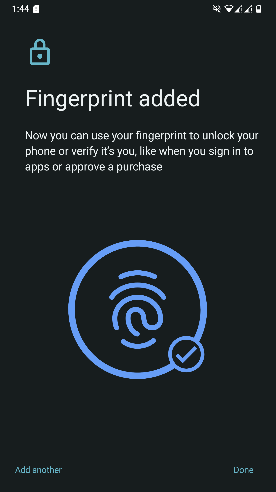|

| | | |
|-|-|-|
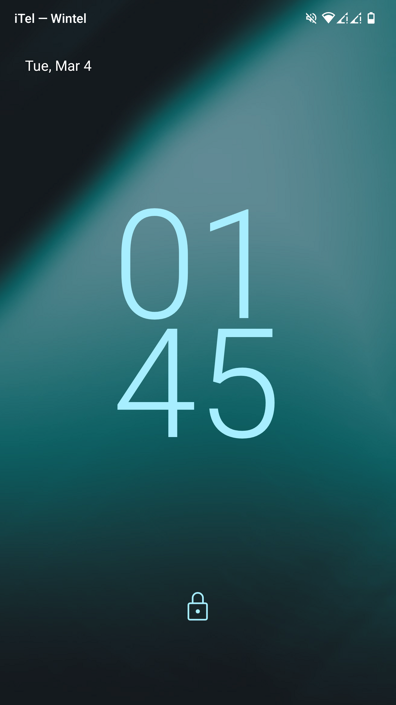|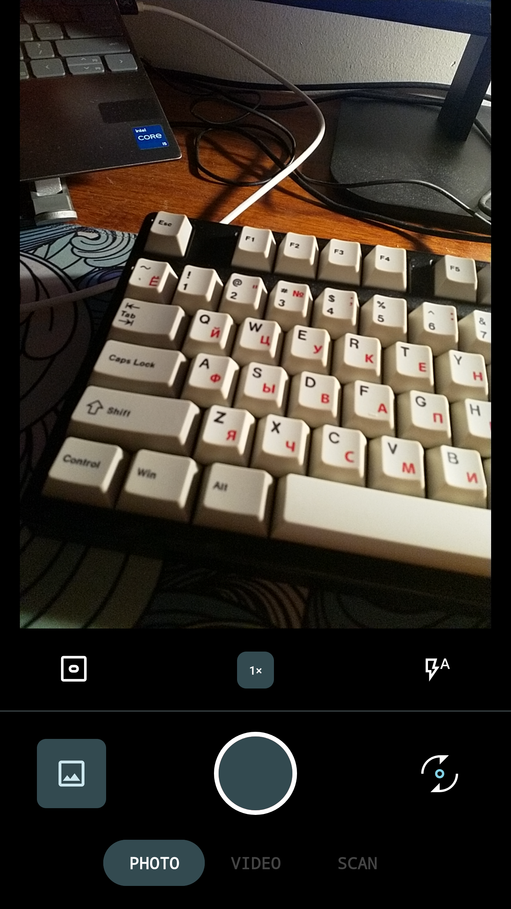|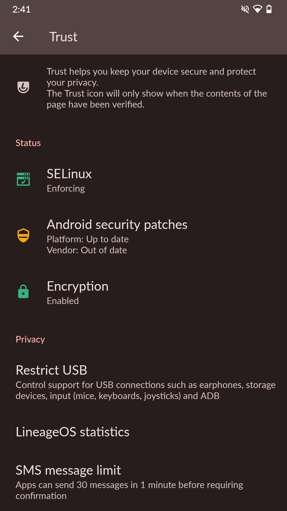|

| | | | |
|-|-|-|-|
||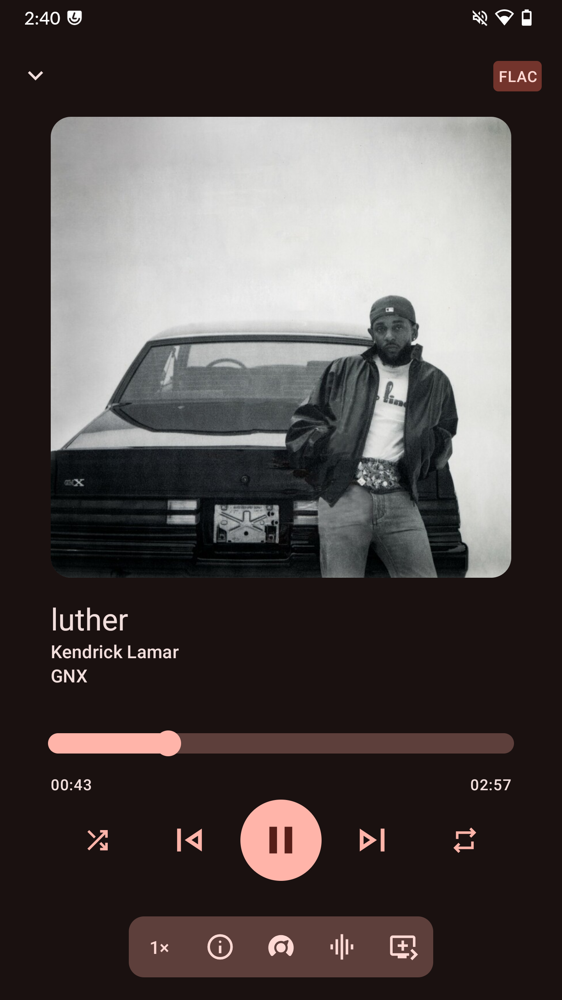|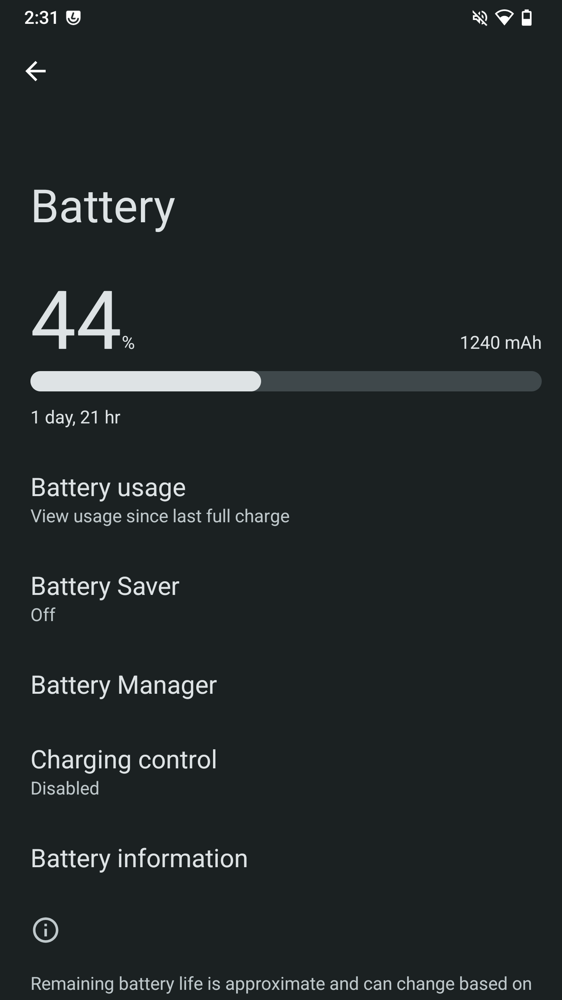|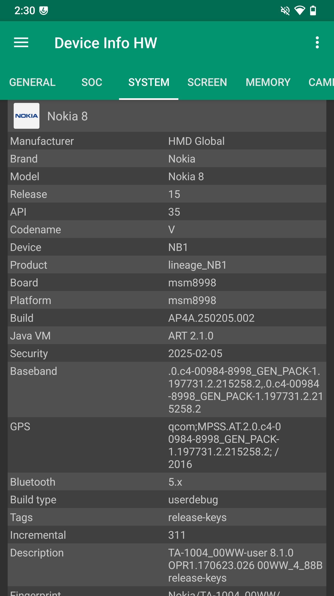|

## Kết thúc
Sau khi vật lộn với con máy này để đem lại sự sống cho nó trong vài năm vừa qua, thì mình thấy mình vẫn còn sức để chuẩn bị fix những lỗi mà Google chuẩn bị mang tới cho các thiết bị legacy =))))))))

Chiếc máy này sau 8 năm chạy vẫn mượt tốt ở Android 15, thậm chí tốt hơn mấy chiếc Redmi Note (trừ Redmi Note 12 đổ đi nhé), vì Android qua những năm qua không có thay đổi quá nhiều về mặt giao diện, nên GPU con này vẫn còn gánh tốt những tác vụ lướt web cơ bản, sử dụng social media hoặc đơn giản là chỉ để nghe nhạc thôi (mình có 1 patch trong audio policy configurations của con này để force con này resample ra 32-bit audio output, nghe một trời một vực phết) và một số tựa game, chẳng hạn như bạn vẫn có thể chạy PUBG ở 60fps, hoặc Genshin Impact ở 30fps (dĩ nhiên là all low). Chiếc Adreno 540 trên con này thực sự là chưa cùi đâu :D

Google rất tích cực trong việc drop support cho các thiết bị legacy những năm gần đây. Cụ thể là việc mỗi năm hoặc mỗi QPR họ sẽ drop cái support cho một kernel LTS nào đấy trong [ACK](https://source.android.com/docs/core/architecture/kernel/android-common), khiến cho việc boot các phiên bản Android cao hơn ở trên những thiết bị dùng kernel cũ trở nên khó khăn hơn rất nhiều.

Nhưng mà, chừng nào cái kernel 4.4 này vẫn còn có thể backport được thêm tính năng từ trên các kernel mới xuống để boot các phiên bản Android cao hơn, thì mình sẵn sàng chiến tay đôi với Google để cho con nhỏ này boot Android 17 và 18, thậm chí là 20 luôn :D

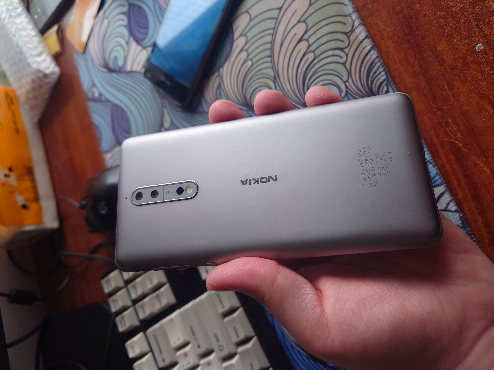

Nhìn máy vẫn đẹp nhỉ, đây là một trong những chiếc HMD đẹp nhất mình từng dùng :D
